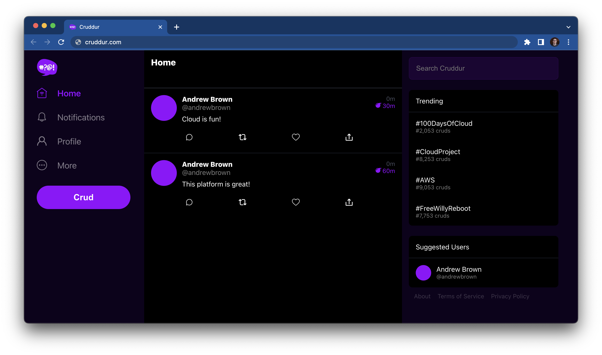

# FREE AWS Cloud Project Bootcamp

- Application: Cruddur
- Cohort: 2023-A1

This is the starting codebase that will be used in the FREE AWS Cloud Project Bootcamp 2023

## Instructions

At the start of the bootcamp you need to create a new Github Repository from this template.

## Journaling Homework

The `/journal` directory contains

- [x] [Week 0](journal/week0.md)
- [x] [Week 1](journal/week1.md)
- [x] [Week 2](journal/week2.md)
- [x] [Week 3](journal/week3.md)
- [x] [Week 4](journal/week4.md)
- [x] [Week 5](journal/week5.md)
- [x] [Week 6](journal/week6.md)
- [x] [Week 7](journal/week7.md)
- [x] [Week 8](journal/week8.md)
- [x] [Week 9](journal/week9.md)
- [x] [Week 10](journal/week10.md)
- [x] [Week 11](journal/week11.md)
- [x] [Week X](journal/week-X.md)
- [x] [Personal CleanUp](journal/P-CleanUp.md)