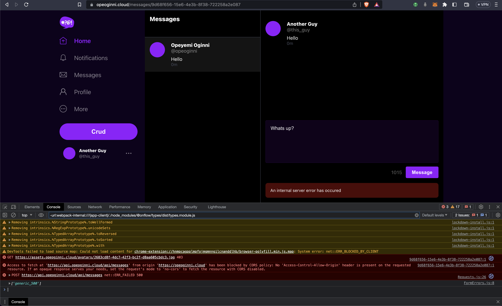
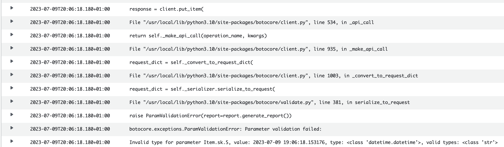
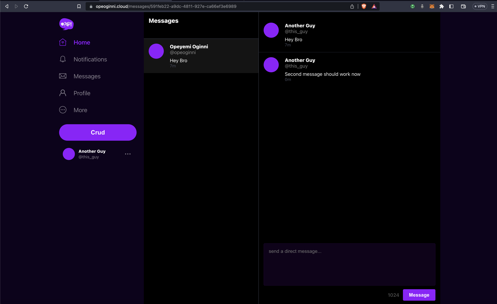
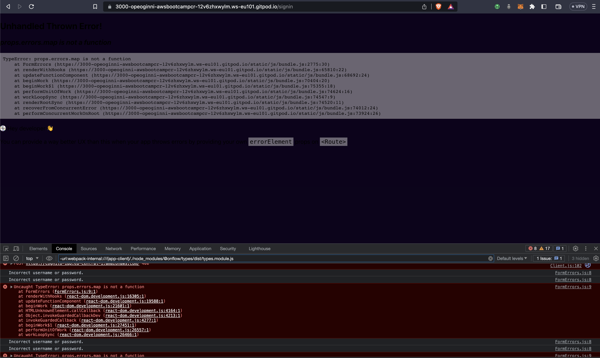
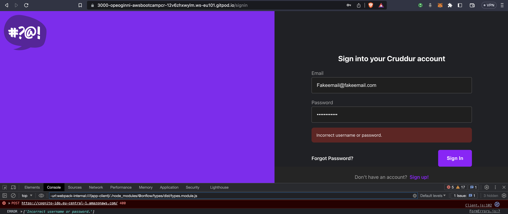

# Week 13 — Personal Cleanup

These are the tasks I completed as my own determination to make my app look and work better.

```
✅ Fixed DynamoDB Direct Messaging Bugs
✅ Fixed SignIn and SignUp Page Errors
```

### ✅ Fixed DynamoDB Direct Messaging Bugs

I noticed in production that after creating a message with another user, it errors out when sending a follow up message. I tried checking if it was a mistake with the DB table name, but it was not.



I then checked my logs from Cloudwatch to see what could be the issue, and I found an error that said I was passing in the wrong data type into the table SK.



The last line has the message `Invalid type for parameter Item.sk.S, value: 2023-07-09 19:06:18.153176, type: <class "datetime. datetime'>, valid types: «class'str'>`. With that Information I went to my [`ddb.py`](https://github.com/OpeOginni/aws-bootcamp-cruddur-2023/blob/main/backend-flask/lib/ddb.py)file, and noticed in the `create_message` function, my variable `created_at` was being passed the `datatime.now()` value which is of type datetime, I had to make sure a string is passed so I added in te `.isoformat()` method. Noticed that this is also what Andrew Did on his own implementation. [**Fix Commit**](https://github.com/OpeOginni/aws-bootcamp-cruddur-2023/commit/378d8b99a5a60a54f2e55c5bd3920fd5340ae537#diff-7317e2c6e08a5529dddb7a84d93204446223c7863e791499fc14ea4d4c5b7c60)

I tested the fix on my Local GitPod Environment, and made a pull request to merge the changes into production.

**Messaging Using Gitpod Environment**


**Messaging In Production**



### ✅ Fixed SignIn and SignUp Page Errors

I fixed the error message for the SignIn and SignUp pages. [**Fix Commit**](https://github.com/OpeOginni/aws-bootcamp-cruddur-2023/commit/378d8b99a5a60a54f2e55c5bd3920fd5340ae537#diff-400adc519df2c3dbec1802e573e2dbdb08cde2f2da0cb1b203e18a5a878398d1).

I just passed in the error message as an array because the [`FormErrors`](https://github.com/OpeOginni/aws-bootcamp-cruddur-2023/blob/main/frontend-react-js/src/components/FormErrors.js#L9C19-L9C19) components maps through them, so If any other data type is passed in, it will error out as it is NOT an array.

**Previous Error**



**Error Message After Fix**




