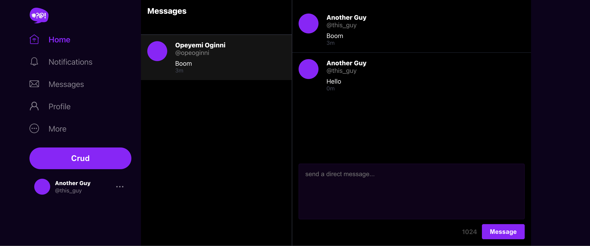
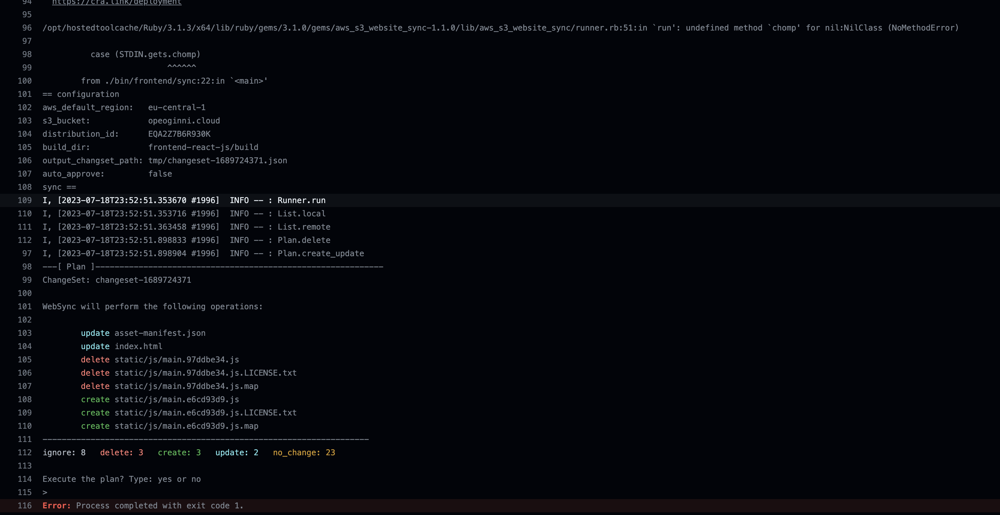

# Week 13 — Personal Cleanup

These are the tasks I completed as my own determination to make my app look and work better.

```
✅ Fixed DynamoDB Direct Messaging Bugs
✅ Fixed SignIn and SignUp Page Errors
✅ Prevented users from Editing the Profiles of other users (Frontend)
✅ Created new python flask endpoint that checks the DynamoDB table if two users have an exisiting message group or not
✅ Better Direct Messaging Flow for Frontend
✅ Created User For GitHub Actions using CloudFormation
✅ Implemented Github Actions to Sync My Cloudfront frontend when I create a PR to `prod` branch
✅ Worked on Replies
✅ Improved Email Confirmation Flow
✅ Display of User Avatar In Profile, Messages, Cruds and Replies
```

### ✅ Fixed DynamoDB Direct Messaging Bugs

I noticed in production that after creating a message with another user, it errors out when sending a follow up message. I tried checking if it was a mistake with the DB table name, but it was not.


I then checked my logs from Cloudwatch to see what could be the issue, and I found an error that said I was passing in the wrong data type into the table SK.


The last line has the message `Invalid type for parameter Item.sk.S, value: 2023-07-09 19:06:18.153176, type: <class "datetime. datetime'>, valid types: «class'str'>`. With that Information I went to my [`ddb.py`](https://github.com/OpeOginni/aws-bootcamp-cruddur-2023/blob/main/backend-flask/lib/ddb.py)file, and noticed in the `create_message` function, my variable `created_at` was being passed the `datatime.now()` value which is of type datetime, I had to make sure a string is passed so I added in te `.isoformat()` method. Noticed that this is also what Andrew Did on his own implementation. [**Fix Commit**](https://github.com/OpeOginni/aws-bootcamp-cruddur-2023/commit/378d8b99a5a60a54f2e55c5bd3920fd5340ae537#diff-7317e2c6e08a5529dddb7a84d93204446223c7863e791499fc14ea4d4c5b7c60)

I tested the fix on my Local GitPod Environment, and made a pull request to merge the changes into production.

**Messaging Using Gitpod Environment**



**Messaging In Production**


### ✅ Fixed SignIn and SignUp Page Errors

I fixed the error message for the SignIn and SignUp pages. [**Fix Commit**](https://github.com/OpeOginni/aws-bootcamp-cruddur-2023/commit/378d8b99a5a60a54f2e55c5bd3920fd5340ae537#diff-400adc519df2c3dbec1802e573e2dbdb08cde2f2da0cb1b203e18a5a878398d1).

I just passed in the error message as an array because the [`FormErrors`](https://github.com/OpeOginni/aws-bootcamp-cruddur-2023/blob/main/frontend-react-js/src/components/FormErrors.js#L9C19-L9C19) components maps through them, so If any other data type is passed in, it will error out as it is NOT an array.

**Previous Error**


**Error Message After Fix**


### ✅ Prevented users from Editing the Profiles of other users (Frontend)

- While Updating the Frontend I fixed the Issue making the MessagesIcon to glow when active. Here is the [commit](https://github.com/OpeOginni/aws-bootcamp-cruddur-2023/commit/731bdb6df3bbdb43e28ce8e5a7cc35eb5700a6df#diff-feca13ed91b31313084d67c9703ca08360faef3ff1e948cce171ca78cc121215)
- In order to prevent this, I did not allow the Edit Profile Button to render If you are not the owner of a profile, instead a Direct Message Icon shows up which takes you to chat with the user. Here is the [commit](https://github.com/OpeOginni/aws-bootcamp-cruddur-2023/commit/caea5e1b02a7ee94f95e573a5171467f0ddc4c17#diff-8b72e4ebe6afc9b82fcdb1f144c2859c958ab22b41da71a16b22e3477411589b). I had to edit the [Profile Heading Component](https://github.com/OpeOginni/aws-bootcamp-cruddur-2023/commit/caea5e1b02a7ee94f95e573a5171467f0ddc4c17#diff-64a5613aeb23a2f2ecdacb22fbb1e625f46ba13dfeab7a32fded8c4e51381bc5) too.
- I also started working on my Github Actions Workflow. I didnt test it yet, but would debug it a bit later. Here is the [commit](https://github.com/OpeOginni/aws-bootcamp-cruddur-2023/commit/731bdb6df3bbdb43e28ce8e5a7cc35eb5700a6df#diff-4596c6d3e4aef378aec46d442919050f11a8f561049f61e5330520e2ec6c60a1)

**Direct Messaging Button For Other Profile**


### ✅ Created new python flask endpoint that checks the DynamoDB table if two users have an exisiting message group or not

For my New Endpoint I created a new [***service***](https://github.com/OpeOginni/aws-bootcamp-cruddur-2023/commit/caea5e1b02a7ee94f95e573a5171467f0ddc4c17#diff-ef203a0d647957f6d7430289732023654307e4fb90fcca5cda6a9cecad0d5c1d) that takes the `cognito_user_id` of a user and gets all message groups they have, this service is used in the new [***route***](https://github.com/OpeOginni/aws-bootcamp-cruddur-2023/commit/caea5e1b02a7ee94f95e573a5171467f0ddc4c17#diff-bd4b87edc06a8375c23402fdfd7672479ee42df24800e660cd56c37957f029b9R88) where I loop through the messageGroups to find one with the handle is the same as the receiver's user handle, as this is the user you are trying to text, if there is a match that means you and the user already have a message group, the endpoint returns true and the `message_group_uuid`, if there is no match the endpoint returns false. The Endpoint looks like this `/api/messages/exist/<string:receiver_user_handle>`.

**NOTE: My Method of checking for if two users have a message group is not that efficient as I am querying for ALL message groups of a user, I will plan on studying up DynamoDB Queries to make a better fitting query that will be more efficient, but for the time being this one works well**

### ✅ Better Direct Messaging Flow for Frontend

Lastly I updated the Frontend to Make use of the `message_group_exists` endpoint, I created a [Direct Message Button Component](ac49e7b87a51e57c11a96d62c160f5ff985b8525f153ff0707349636fd9fbf26) that uses this endpoint to know if to redirect the user to a NEW message group with another user or an already exising one.

**Endpoint and Flow In Action**


### ✅ Created User For GitHub Actions using CloudFormation

I used CloudFormation to create a User that will provide Access Keys to my GitHub in order to Sync My frontend using Github Actions. I added Roles to prevent the keys from making any further actions in my AWS account. Here is the [commit](https://github.com/OpeOginni/aws-bootcamp-cruddur-2023/commit/df2af80d3fbfe44b2144bf8695e87e54e095f562#diff-5951319f619e05e0d80794c628c62c4c12dac9a541d8fcf4862769f699dd2681)

[**TEMPLATE**](https://github.com/OpeOginni/aws-bootcamp-cruddur-2023/blob/main/aws/cfn/github-actions-user/template.yaml)

**CFN Changeset**


**CrdGithubActionsUser CFN Stack**


### ✅ Implemented Github Actions to Sync My Cloudfront frontend when I create a PR to `prod` branch

This implementation took a lot of time, testing, trials and errors. But I got it working after it all. Here are some Major Changes I made to the previous Workflow Andrew provided.

- I noticed I had to stack commands on each other to work well, for example If I wanted to `cd` to a directory and run `npm ci` in it I had to write the commands together not seperately. do this was my build command `cd frontend-react-js && npm ci && npm run build`. [**COMMIT**](https://github.com/OpeOginni/aws-bootcamp-cruddur-2023/commit/d137baf2cb1388d3462e4e78d2de7b0d32326f07).
- I disabled ESLINT when building as the warnings given were treated as ERRORS by Github Actions and didnt let the build to pass even when it was alright. [**COMMIT**](https://github.com/OpeOginni/aws-bootcamp-cruddur-2023/commit/aad972bb3e96231683dc84b5a758f05c7b322902).
- I created a new static-build script that was made specifically for Github Actions, as the previous one was made using the PATHS of Gitpod. [**COMMIT 1**](https://github.com/OpeOginni/aws-bootcamp-cruddur-2023/commit/9cb5c8fd1044eb5a1aa1f5477dacd4f624d89b1f) and [**COMMIT 2**](https://github.com/OpeOginni/aws-bootcamp-cruddur-2023/commit/fbf05f4e8ab98b4ed5da83f5011d4010549f6d9f). Here is the new Script [`static-build-prod`](https://github.com/OpeOginni/aws-bootcamp-cruddur-2023/blob/main/bin/frontend/static-build-prod).
- Next I needed to pass in env vars to the sync script, I tried running the `./bin.frontend/generate-env` script but it was not working. After looking at the docs I found out we can pass the env to the command [**DOCS**](https://docs.github.com/en/actions/learn-github-actions/variables). So I hardcoded the needed VARs, [**COMMIT 1**](https://github.com/OpeOginni/aws-bootcamp-cruddur-2023/commit/d0f82124c8e1d0680a44ff5e4c53b50e5ee0f526). after this commit I was still having errors and had to change the PATHS of my ENVars, [**COMMIT 2**](https://github.com/OpeOginni/aws-bootcamp-cruddur-2023/commit/2054c27abc5cd72eeca6752ed828666c2a31bca6), this one worked. I also put the `SYNC_AUTO_APPROVE` VAR to true as we cannot approve to SYNC on github actions.

After these changes the workflow completed running but still had a major error. It only made DELETES to CloudFront instead of Updates and Creates and completely removed the functionality from my Live Site. 

**Only DELETES**


I felt it was a Permissions Issue to the ActionsUser, and had to take a look at the `aws_s3_website_sync` gem, to see how it works and where the issue might be from. ChatGPT pointed out that it might be deleting only because the script doesnt see any files, so It thinks I have deleted all my files, this made me start checking if it is a PATH issue, maybe I am pointing at the wrong Build File. After making changes to the path it finally started making UPDATES and CREATES, [**COMMIT**](https://github.com/OpeOginni/aws-bootcamp-cruddur-2023/commit/d4faadee60b3ac97563681b9a543722162badc0f). It was all continous Trial and Error to get it working 😎.

**CREATES and UPDATES**



**Final Results**


### ✅ Worked on Replies

- I worked on the HomePage SQL query to only return actual Cruds not Replies too, I made a little change to the SQL, [**COMMIT**](https://github.com/OpeOginni/aws-bootcamp-cruddur-2023/commit/b19082edf8d93908ab9d04f8940a9cd0760c635f#diff-5c1a2b6b47243795c31c78ab3d3c6ff2032c31a174f9f58a7dc94313f86f239c).
- Made an update to the Reply Endpoint and code, that increases the number of Replies shown on a Crud when a new reply is made, [**COMMIT**](https://github.com/OpeOginni/aws-bootcamp-cruddur-2023/commit/c606b6e34f2d8e31e22fbbd9f216147e74800b7f#diff-244518b85d07c73fe8597784e2aeea14ec1d2fdb62d85f64bc03aef7e2aef71a). I did this by creating a new SQL file that increases the replies_count value, and I made come changes on the frontend that makes the value to be increased by 1 as the user submits the reply.

### ✅ Improved Email Confirmation Flow

I improved the flow when users are confirming their account, they don't have to put in their email address after signing up, it is done by react automatically, [**Confirmation Page Flow Improvement COMMIT**](https://github.com/OpeOginni/aws-bootcamp-cruddur-2023/commit/8df3fff21cb9d2d66ec3a2122fcd066f84027cc1). 


### ✅ Display of User Avatar In Profile, Messages, Cruds and Replies

This integration took a while and I had to do a lot of debuging, mostly because of CORS, I had to change the Allowed Origin URL for both the Uplaod Lamdba and the Uplaod S3 Bucket, in order to let requests from my site to be handled.

**Updating CORS for Lambda**


**Updating CORS for S3 Bucket**


Lastly I had to make multiple changes on my frontend to display User Avatars in the places they are needed. Here are my commits:

- [Add Reply Increase, Fixed Avatar Upload & Display](https://github.com/OpeOginni/aws-bootcamp-cruddur-2023/commit/c606b6e34f2d8e31e22fbbd9f216147e74800b7f)
- [Fixed Frontend Bugs](https://github.com/OpeOginni/aws-bootcamp-cruddur-2023/commit/9b4d031a22db42f703c59e52f84d285a0b2fb438)

**Improved UI**


**User Avater Redenring in Home Page and Replies**


