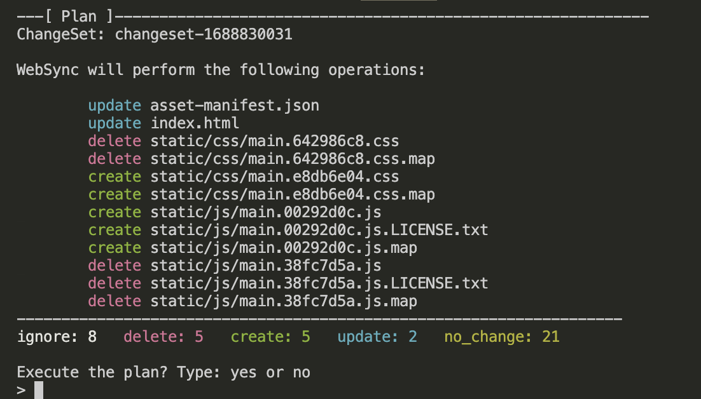

# Week X — Cleanup

## Week X Tasks

These are the tasks I completed during the last week of the bootcamp.

```
✅ Sync tool for static website hosting (Hosting Frontend on CloudFront)
✅ Reconnected the DB and Postgre Confirmation Lambda
✅ Fixed CORS to use domain name for web-app
✅ Ensure CI/CD pipeline works and create activity works
✅ Refactor to use JWT Decorator in Flask App
✅ Refactor App.py
✅ Refactor Flask Routes
✅ Implement Replies for Posts
✅ Implemented the Activities Show Page
✅ Week-X Cleanup I
✅ Week-X Cleanup II
```

### ✅ Sync tool for static website hosting (Hosting Frontend on CloudFront)

- First off we created a Static Build Script for building the frontend on cloud-front. [**Check out Commit**](https://github.com/OpeOginni/aws-bootcamp-cruddur-2023/commit/d81bc78397b8cba0c9f02756e76c556b1ee0dd42#diff-a404a57eef73276ef9d2af5eaf105d2f7e316b4999078e89d1ed1bd47cc00704)
- I then Unzipped the the build folder and uploaded it to the CloudFront s3 bucket.
- Next, I created a sync ruby script for the static site S3-Bucker, with an extra sync.env file that holds extra environment variables for updating the static cloudfront site. [**Check out Commit**](https://github.com/OpeOginni/aws-bootcamp-cruddur-2023/commit/d825f1ca947e33c43a320f339eb63392c640716f#diff-9404828f7a16807d6d3d6e6fb5f7fbb0197fd084127ab97b25b112906965c634)
- I used CFN to create a CrdSyncStack
- Finnally created and added a role to the CrdSyncStack to give access to updated the static Site S3 Bucket

***Proof Of Task***

**Cloudfront Static Site working**


**CrdSyncRole CFN Stack**


**CrdSyncRole Stack Role for acceccing the Static Site S3 Bucket**


### ✅ Reconnected the DB and Postgre Confirmation Lambda

- Removed the Python Flask Service from running on Debug Mode. [**Check out Commit**](https://github.com/OpeOginni/aws-bootcamp-cruddur-2023/commit/0b6ad62ef6a131a884c3a4d8f3e88e955519f22a). I didnt have to delete the Stack like Mr Andrew did, instead after building the prod container with the --no-debug tag added, I pushed the new image to ECR and made and executed a change set to the CFN template, and just waited, the conainer ended up being healthy.
- Updated my Environment Variables to use the datails from the new Cruddur Database Instance made with CFN, so we can connect to the DB using our scripts on GITPOD.
- I loaded the Schema and Migration to the Production DB Instance.
- Set Up error handling page in the CFN template. [**Check out Commit**](https://github.com/OpeOginni/aws-bootcamp-cruddur-2023/commit/49999c4e7d1845989755c8223cea8d98ada91926)
- My lambda code already creates a user object in the Dtabase corretly, so I did not hsve sny errord in creating Cruds. [`aws/lambdas/cruddur-post-confirmation.py`](https://github.com/OpeOginni/aws-bootcamp-cruddur-2023/blob/main/aws/lambdas/cruddur-post-confirmation.py)

***Proof Of Task***

**Created SG for Post Confirmation Lambda to connect to our DB**


**Working Backend after connectin Production Database and Loading the Schema**


### ✅ Fixed CORS to use domain name for web-app

### ✅ Ensure CI/CD pipeline works and create activity works

- I have already made an implementation for users creating activities that showcased their original name and username, not the hardcoded one. [`backend-flask/app.py`](https://github.com/OpeOginni/aws-bootcamp-cruddur-2023/blob/main/backend-flask/app.py#L282)
- I fixed the CICD pipeline CFN template. **Check out Commits**[Fixed the config param](https://github.com/OpeOginni/aws-bootcamp-cruddur-2023/commit/7ca838ef265fadd8299406d6af68f19a53e9b474), [Fixed codebuild name](https://github.com/OpeOginni/aws-bootcamp-cruddur-2023/commit/d08386856378c655de535b411a058f20ae65f148),[Week-X CICD Pipeline and Create Activity](https://github.com/OpeOginni/aws-bootcamp-cruddur-2023/commit/4f10000da861b5672517c491f38b2320e6c89e9a)

### ✅ Refactor to use JWT Decorator in Flask App

I already had a decorator of mine I created at week 3, I used it as a middleware to check out the JWT that is being sent in.
The commit for my implementation is here -> [Implemented a verify JWT middleware, Tried to Implement Google SignIn…](https://github.com/OpeOginni/aws-bootcamp-cruddur-2023/commit/3d21410f07464370171cc9b9ef72f4ffbbc8419e). I ended up using both the new JWT Decorator and my old one.

Here are the Commits for this task:
- [Starting to Refactor JWT using a decorator](https://github.com/OpeOginni/aws-bootcamp-cruddur-2023/commit/b6bca3b120bd55c429019033a9e774b6c04be63c)
- [refactored jwt with a decorator, fixed close popup](https://github.com/OpeOginni/aws-bootcamp-cruddur-2023/commit/4ef1102ad3ad580ed24fc8cbaf06377e98713921)

### ✅ Refactor to use JWT Decorator in Flask App

Here are the Commits for this task:
- [Finished up initialization Refactorization](https://github.com/OpeOginni/aws-bootcamp-cruddur-2023/commit/6b33e2e7c9648e4a47751e900a8b32594ecc68f4)

### ✅ Refactor Flask Routes

Here are the Commits for this task:
- [Week-X Refactor Flask Routes](https://github.com/OpeOginni/aws-bootcamp-cruddur-2023/commit/30238cbc7865bdce043c63c05a3484febc32f36f)

### ✅ Implement Replies for Posts

Here are the Commits for this task:
- [Started fixing the Replies](https://github.com/OpeOginni/aws-bootcamp-cruddur-2023/commit/62b2a7aea3b3d80ed8651fd73679977280b74ed5)
- [Fixed Replies, Created New Migration](https://github.com/OpeOginni/aws-bootcamp-cruddur-2023/commit/6866357e4e4c66287ad4411af0fb08745949de0a)
- [Fixed Replies Bug and Started Error Handling](https://github.com/OpeOginni/aws-bootcamp-cruddur-2023/commit/5f4654b6bfdcd05e8ef9704d11481c60e6c2fc03#diff-5c1a2b6b47243795c31c78ab3d3c6ff2032c31a174f9f58a7dc94313f86f239c)

***Proof Of Task***

**Replies Functionality Working**


### ✅ Improved Error Handling for the app

Here are the Commits for this task:
- [Fixed Replies Bug and Started Error Handling](https://github.com/OpeOginni/aws-bootcamp-cruddur-2023/commit/5f4654b6bfdcd05e8ef9704d11481c60e6c2fc03#diff-5c1a2b6b47243795c31c78ab3d3c6ff2032c31a174f9f58a7dc94313f86f239c)
- [Refactored Error Handling and Fetch Requests](https://github.com/OpeOginni/aws-bootcamp-cruddur-2023/commit/4efdf0e7e6c88d5dc7495a2fe29204b6897cbc21)

After running the Project Validator I notices a mistake in my Frontend CFN template. My Website Config mapped the Index Document and the Error Documents to `.js` files isntead of `.html` files.

[Made change to Frontend CFN Template](https://github.com/OpeOginni/aws-bootcamp-cruddur-2023/commit/076a53396983fd0bdcd641ec140cbd0e7f62e32e)

***Proof Of Task***

**Better Error Handling On the Frontend**


### ✅ Implemented the Activities Show Page	

In order to make the app look a lot more compact Replies are only shown in an independed page for each Crud, we called ut the Activities Show Page.

Here are the Commits for the implementation:
- [Started Activity Show page Video](https://github.com/OpeOginni/aws-bootcamp-cruddur-2023/commit/cb71f95be358af321dd80d31c56a6cba08c8cd09)
- [Created Activities Show Page](https://github.com/OpeOginni/aws-bootcamp-cruddur-2023/commit/0b136acf0c14f27c362350693b3b653f2b9df4ad)

***Proof Of Task***

**Activity Show Page**


### ✅ Week-X Cleanup I

- Worked on the Show Activity Service .py file to return a object with the crud and its replies instead of an array. [**Check out Commit**](https://github.com/OpeOginni/aws-bootcamp-cruddur-2023/commit/a4ae34bc2ae4bd389c535dbd33db2f5eb1da940e)
- Fixed up the SQL code to fetch activities for the home page, and worked on the DateTimeFormats, giving acurate time of posts and replies. [**Check out Commit**](https://github.com/OpeOginni/aws-bootcamp-cruddur-2023/commit/784ca8cc3a49a04b0fa629e7ec65c685ce58595b)
- Created different Activity Components for Normal Cruds and a different one for Replies. [**Check out Commit**](https://github.com/OpeOginni/aws-bootcamp-cruddur-2023/commit/3eb62feff8a469a2e8057736efc7b5b63be3bc0f)
- I built the frontend and Synced it. But had some issues, noticed that it was cause of I was passing in the Distribution link instead of the ID. [**I Fixed it here**](https://github.com/OpeOginni/aws-bootcamp-cruddur-2023/commit/f5798e777cc7ef5aeaf4c33b5368f53cf27ce373)

***Proof Of Task***

**Running the Frontend Cloudfront Sync Script**



### ✅ Week-X Cleanup II

For this clean up we focused more on getting te Production Messaging with DynamoDB Working.

- I updated the production dynamoDB Table to be used. [**Check out Commit**](https://github.com/OpeOginni/aws-bootcamp-cruddur-2023/commit/8f6602a85a0589a411b3a23453ba98f989ba9385)
- Created a MachinUser using CFN. [**Check out Commit**](https://github.com/OpeOginni/aws-bootcamp-cruddur-2023/commit/18c16d22c903e5aab040da2f63b8f8003afa5793)

***Proof Of Task***

**MachineUser**


**Direct Messages Working In Production**


