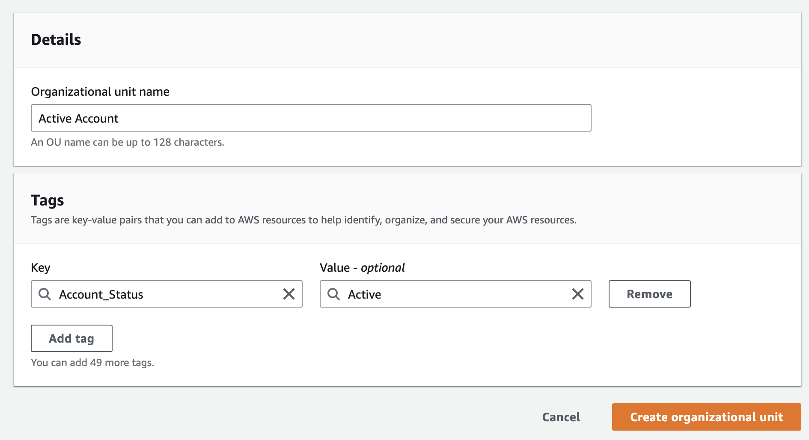
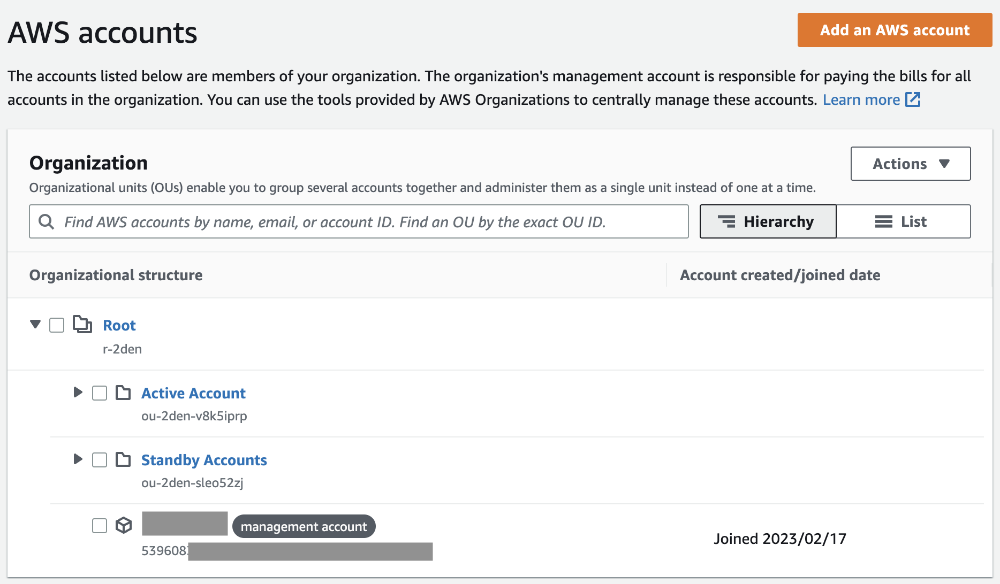
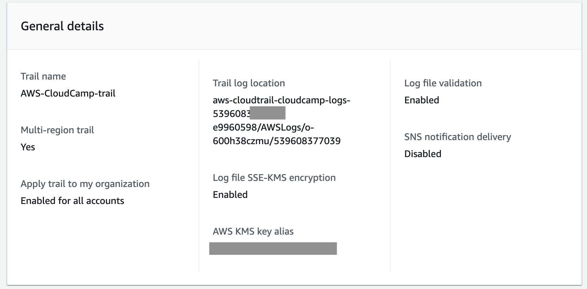
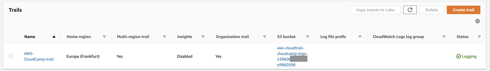

# Week 0 — Billing and Architecture

## Week 0 Tasks

These are the tasks I completed during this week.

```
✅ Set up 2 AWS Budget
✅ Generated AWS Credentials
✅ Used and Tested CloudShell
✅ Installed the AWS CLI on Gitpod and added my AWS Credentials
✅ Used the CLI from Gitpod to create a Budget and a Billing Alarm
✅ Created a Conceptual Architecture Diagram on a Napkin
✅ Created an architectural diagram the CI/CD logical pipeline in Lucid Charts
✅ Set up MFA for Root Account and create IAM role
✅ Created 2 AWS Organizations
✅ Created a Trail that logs all actions in my AWS Organization
✅ Used EventBridge to hookup Health Dashboard to SNS and send notification when there is a service health issue
```
All these Individual tasks will be discussed below. I will state my process of completing the task, add screenshot proofs and give details about some issues I came across and how I debugged these issues for tasks that requires these information.

### ✅ Set up 2 AWS Budget

For this task I created 2 separate Budgets, one for Credits use and the other was created using the CLI and covers all forms of spending.


**As proof, here is an alert I got after creating a ZeroSpend Budget**


I deleted it to create other test budgets.


### ✅ Generated AWS Credentials
- Generated Access Keys
- Gave it a description of "My New Access Key"
- Downloaded and saved the .csv file

### ✅ Used and Tested CloudShell


### ✅ Installed the AWS CLI on Gitpod and added my AWS Credentials


#### Issues and Fixes
For this task I ran through some Issue
- First Issue was that the terminal wis giving me the wrong outputs after running `aws budgets create-budget`. I solved this issue by correctly naming my `budget-notifiactions-with-subscriber.json` file.
- After solving the first Issue I was still reciving the wrong out put from the terminal, after looking at the error, I found out that I hadn't properly exported my `ACCOUNT_ID` to an environment variable. I solved this issue by running the command `export ACCOUNT_ID = $(aws sts get-caller-identiy --query Account --output text)`

### ✅ Used the CLI from Gitpod to create a Budget and a Billing Alarm

- Created an sns topic from the CLI using gitpod with the command `aws sns create-topic --name CLI-generated-billing-alarm`

**Proof is in the commits made to the code 🚀** 

[Code for Alarm](https://github.com/OpeOginni/aws-bootcamp-cruddur-2023/blob/main/aws/json/alarm-config.json)
[Code for Budget](https://github.com/OpeOginni/aws-bootcamp-cruddur-2023/blob/main/aws/json/alarm-config.json)

- **SNS Confirmation**


- **CloudWatch Alarm**


### ✅ Created a Conceptual Architecture Diagram on a Napkin


### ✅ Created an architectural diagram the CI/CD logical pipeline in Lucid Charts

**[Link to Diagram](https://lucid.app/lucidchart/dafb1a03-bc79-4c9c-84f5-318bc2cfe7e6/edit?viewport_loc=-107%2C-265%2C2232%2C1656%2C0_0&invitationId=inv_612263c3-6f07-4268-884b-c9f02de4d026)**


## Homework Challenges

### ✅ Set up MFA for Root Account and create IAM role

- Added MFA for my Root Account using Authy
- Created new User and added that user to an 'admin' user group
- Added MFA for my new 'admin' user


### ✅ Created 2 AWS Organizations
- I used the method of creating Organizations recommended by Ashish, in the [Week0 Security Video](https://www.youtube.com/watch?v=4EMWBYVggQI&list=PLBfufR7vyJJ7k25byhRXJldB5AiwgNnWv&index=15) 
- Created a Standby Account Organization for Accounts I create that are not operational
- Created an Acctive Account Organization for Accounts that are active.




***Learnt a lot about making sure I used Tags when creating services to help with organization and ease billing search***

### ✅ Created a Trail that logs all actions in my AWS Organization




### ✅ Used EventBridge to hookup Health Dashboard to SNS and send notification when there is a service health issue

- **I created an SNS Topic for the Notification**


- **My process on using EventBridge to create the Notification when any event from the AWS Health Service is triggered**


- **Final Results**


#### Issues and Fixes
For this task I had the issue of using the wrong region for creating my SNS topic. I created the SNS topic in US-East-1 region and was using it for my EventBridge Notification in the EU-Central-1 region. Took me some time to figure out my mistake.
***Learnt from this issue that I should always be aware of the region I am using to create a service.***
