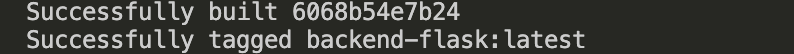

# Week 1 — App Containerization

## Week 1 Tasks

These are the tasks I completed during this week.

```
✅ Watched all Bootcamp Videos for the week
✅ Containerized my application (Docker files, Docker Compose)
```
All these Individual tasks will be discussed below. I will state my process of completing the task, add screenshot proofs and give details about some issues I came across and how I debugged these issues for tasks that requires these information.

### ✅ Watched all Bootcamp Videos for the week

### ✅ Containerized my application (Docker files, Docker Compose)

- Created Docker Files for the Frontend and Backend
    - **[Frontend Docker File](https://github.com/OpeOginni/aws-bootcamp-cruddur-2023/blob/main/frontend-react-js/Dockerfile)**
    - **[Backend Docket File](https://github.com/OpeOginni/aws-bootcamp-cruddur-2023/blob/main/backend-flask/Dockerfile)**
- Built the Backend Docker File



- **[Created Docker Compose File](https://github.com/OpeOginni/aws-bootcamp-cruddur-2023/blob/main/docker-compose.yml)**
- I ran the compose file and tested the app


