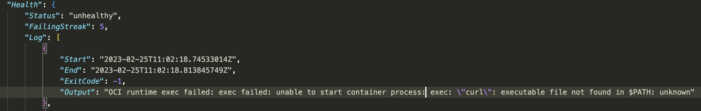
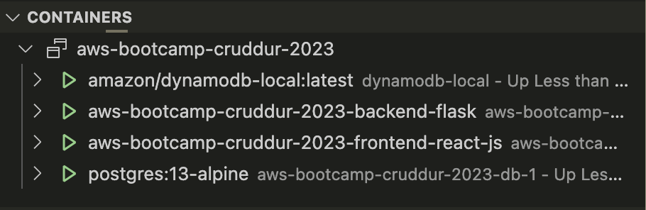

# Week 1 — App Containerization

## Week 1 Tasks

These are the tasks I completed during this week.

```
✅ Watched all Bootcamp Videos for the week
✅ Containerized my application (Docker files, Docker Compose)
✅ Containerized my application (Docker files, Docker Compose)
✅ Added Documentation for the Notification Endpoint on the OpenAI Document, Wrote a Flask Backend Endpoint for Notifactions and wrote a React Page for Notifications
✅ I ran DynamoDB Local Container and Postgres Container
✅ Added NPM install command to gitpod.yml
✅ I implemented HealthCheck in the docker-compose
✅ Created my personal Cloud Journey Roadmap using the My Journey To Cloud template
```
All these Individual tasks will be discussed below. I will state my process of completing the task, add screenshot proofs and give details about some issues I came across and how I debugged these issues for tasks that requires these information.

### ✅ Watched all Bootcamp Videos for the week

### ✅ Containerized my application (Docker files, Docker Compose)

- Created Docker Files for the Frontend and Backend
    - **[Frontend Docker File](https://github.com/OpeOginni/aws-bootcamp-cruddur-2023/blob/main/frontend-react-js/Dockerfile)**
    - **[Backend Docker File](https://github.com/OpeOginni/aws-bootcamp-cruddur-2023/blob/main/backend-flask/Dockerfile)**
- Built the Backend Docker File


- Created Docker Compose File
    - **[Check out Docker Compose Code](https://github.com/OpeOginni/aws-bootcamp-cruddur-2023/blob/main/docker-compose.yml)**
- I ran the compose file and tested the app


### ✅ Added Documentation for the Notification Endpoint on the OpenAI Document, Wrote a FLask Backend Endpoint for Notifactions and wrote a React Page for Notifications

- Commit that shows I Documented the Notification Endpoint in the OpenAI file: [commit](https://github.com/OpeOginni/aws-bootcamp-cruddur-2023/commit/12091f574cd7e580342cc52971b7ad5a8070ede6)
- Created `notifications_activites.py` file: 
    - [notifications_activities.py](https://github.com/OpeOginni/aws-bootcamp-cruddur-2023/blob/main/backend-flask/services/notifications_activities.py)
    - Commit change creating the `/notifications` route in the `app.js` file: [commit](https://github.com/OpeOginni/aws-bootcamp-cruddur-2023/commit/66e37c0b62875f45a60fbbfad3e38da2729fcf98)
- Wrote a React Page for Notifications: [`NotificationsFeedPage.js`](https://github.com/OpeOginni/aws-bootcamp-cruddur-2023/blob/main/frontend-react-js/src/pages/NotificationsFeedPage.js)


**Issues and Fixes**

- I encountered a 404 error when trying to view the notifications page. I did some debugging and found out I had not assigned the correct route to display the notification page. I used the route `/` instead of `/notifications`. I made use of the browser console to do my debugging, so i easily fixed the big.

### ✅ I ran DynamoDB Local Container and Postgres Container


## Homework Challenges

### ✅ Added NPM install command to gitpod.yml

- [Check out the commit](https://github.com/OpeOginni/aws-bootcamp-cruddur-2023/commit/2049edad4784d69ee4abfa296d2f6c386e041b1a) 

### ✅ I implemented HealthCheck in the docker-compose

**Did some reasearch in the [Docker Docs](https://docs.docker.com/compose/compose-file/compose-file-v3/#healthcheck) to find out about healthcheck and how to implement it**


[Link to commit](https://github.com/OpeOginni/aws-bootcamp-cruddur-2023/commit/d39f43fdb4bd1cae86eeec10b88a01abbabb4347)

#### Immediate Results
**Frontend Container HealthCheck**


**Backend Container HealthCheck**



I solved the backend container issue, the description is shown below.


***Issues I went through***
- The Backend Container always had a health status of unhealthy. I did some debbuging and an error message was given about curl not being installed, after some research and talking to some other students I found the right command to install curl into the backend container and I added this comand to the Docker file, here is the [commit](https://github.com/OpeOginni/aws-bootcamp-cruddur-2023/commit/347627d31fd5d3efb0caf221d048c4425e0e9032).
- I tried using the home route of the backend container `https://4567-${GITPOD_WORKSPACE_ID}.${GITPOD_WORKSPACE_CLUSTER_HOST}` as the route to run the healthcheck on, but this didn't work well. I then remeberd that this route returned nothing and I tried using a route that returned a value, like the `api/activities/home` route.

**Result of Backend Container HealthCheck after fix**


**Proof of all containers Running**



### ✅ Created my personal Cloud Journey Roadmap using the My Journey To Cloud template


