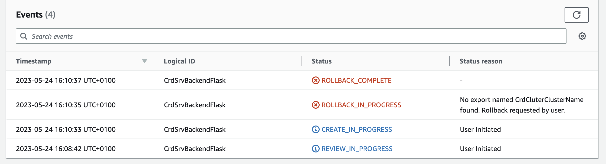
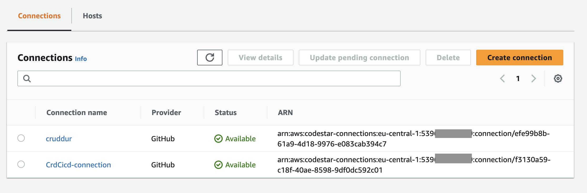

# Week 10 - 11 — CloudFormation 

## Week 10 - 11 Tasks

These are the tasks I completed during the 10th and 11th week.

```
✅ Watched the CFN Security with Ashish Video 
✅ Watched the Live-Stream Cloudformation (CFN) Basics
✅ Implemented the CFN Networking Layer
✅ Implemented the CFN Cluster Layer	
✅ Implemented CFN Toml	
✅ Implemented CFN Service Layer for Backend	
✅ Implemented CFN Database Layer (RDS)	
✅ Implemented DynamoDB using SAM
✅ Implemented CI/CD	
✅ Implemented CFN Static Website Hosting for Frontend
✅ Completed Diagraming for CFN Networking layer, Database Layer, Service Layer, DynamoDB and CI/CD
```

### ✅ Watched the Live-Stream Cloudformation (CFN) Basics

While watching the Live-Stream I got an understanding on what CloudFormation is all about and its uses. I was at first asking myself why we need to learn how to create all resources using code when we can do so effortlessly using Clickops, but the explanation from Mr Andrew was clear and helped me understand that at times we might need some flexibility in creating resources and CFN gives that to us.

So for the Live-Stream we made some CFN templates.

Commits for the Live-Stream are below:

- [Started Creating the cnf template.yaml file](https://github.com/OpeOginni/aws-bootcamp-cruddur-2023/commit/2b4b859fe90bdd55b6cbb8841e192ffce4583ade)
- [Testing GitHub Commit](https://github.com/OpeOginni/aws-bootcamp-cruddur-2023/commit/1a4bd0a8d60e40a6b93fef3e5aa0bd1475509169)
- [Created template.yaml file and cfn deploy script](https://github.com/OpeOginni/aws-bootcamp-cruddur-2023/commit/d43e4bc07afeebe08fe6188a1d01edb2608bcbd0)

***Proof Of Task***

**Making a Changeset using the CLI**


**Cluster Created using CloudFormation**


**Created S3 Bucket to store CFN Templates**


### ✅ Implemented the CFN Networking Layer

Commits for this task are below:

- [Started Working on the networking template.yaml](https://github.com/OpeOginni/aws-bootcamp-cruddur-2023/commit/87e350d61a9f6c875678568bcfbf3eedc6c58d38)
- [Update to networking template file](https://github.com/OpeOginni/aws-bootcamp-cruddur-2023/commit/865a313e1e317a0497af381af86d0994a336ff1e)
- [Completed the networking layer (template.yaml)](https://github.com/OpeOginni/aws-bootcamp-cruddur-2023/commit/983bbd49b44504fbcaa1e6ad09fa2ce4f045e82a)
- [Updated CFN Networking Template and deploy scrips](https://github.com/OpeOginni/aws-bootcamp-cruddur-2023/commit/af20100a254f519ac1e835b065a1ab27545951f4)

***Proof Of Task***


**Issues during this task**

For this task I had an issue with the Code Editor verifiying my code. I tried debugging and searching through StackOverflow and found a solution, I had to make some changes to the Code Editor adding some yaml tags.


### ✅ Implemented the CFN Cluster Layer	

Commits for this task are below:

- [Started cluster template.yaml](https://github.com/OpeOginni/aws-bootcamp-cruddur-2023/commit/7cdf816198502cc84a27bdfd4f9b471a9a517905)
- [Updated CFN Networking Template and deploy scrips](https://github.com/OpeOginni/aws-bootcamp-cruddur-2023/commit/af20100a254f519ac1e835b065a1ab27545951f4)
- [Completed Cfn Cluster Template.yaml file](https://github.com/OpeOginni/aws-bootcamp-cruddur-2023/commit/2d8eced5c9f92f7dd3226865c5213275e6f7a69b)
- [Added Crucial AWS Docs links for Cluster Resources](https://github.com/OpeOginni/aws-bootcamp-cruddur-2023/commit/453f652c48df3ffaa225cf8f9df8edd379cc912f)
- [Fixed Up my Cfn Cluster Template](https://github.com/OpeOginni/aws-bootcamp-cruddur-2023/commit/48752d0d120be165b7a66a962af3f3ed3740a293)
- [Refixed the cfn cluster template](https://github.com/OpeOginni/aws-bootcamp-cruddur-2023/commit/65214a0a645899c6fd8cd5f13a56f0f9ab406124)

***Proof Of Task***


### ✅ Implemented CFN Toml	

Commits for this task are below:

- [Created CFN Toml files](https://github.com/OpeOginni/aws-bootcamp-cruddur-2023/commit/08cafdab9ae57241e661a3bd208e3b319684e899)
- [Fixed Up my Cfn Cluster Template](https://github.com/OpeOginni/aws-bootcamp-cruddur-2023/commit/48752d0d120be165b7a66a962af3f3ed3740a293)
- [Refixed the cfn cluster template](https://github.com/OpeOginni/aws-bootcamp-cruddur-2023/commit/65214a0a645899c6fd8cd5f13a56f0f9ab406124)

***Fixing Cluster CFN Issues***

I had an issue that prevented my Service from being created. From looking at the error message, I found out it was an error in my naming and I had to resolve the issue.
Named my Cluster Stack as CrdCluter instead of CrdCluster




### ✅ Implemented CFN Service Layer for Backend	

Commits for this task are below:

- [Started making cfn template for service](https://github.com/OpeOginni/aws-bootcamp-cruddur-2023/commit/ae1827ec9dffa72a3716ad347ab086d151109cf6)
- [Started CFN Service Layer](https://github.com/OpeOginni/aws-bootcamp-cruddur-2023/commit/e6ebed7ea1abdaec6e5225c95471f9eb5ed00bca)
- [CFN ECS Fargate Service Debugging](https://github.com/OpeOginni/aws-bootcamp-cruddur-2023/commit/4f467b52c9aae4dd168e3f64cf9ebb4ea4ee2dee)
- [Further CFN Fargate Debugging, added output](https://github.com/OpeOginni/aws-bootcamp-cruddur-2023/commit/80fa127ee839df018154749342940412449a4b7d)
- [Completed CFN RDS and Fixed CFN Service](https://github.com/OpeOginni/aws-bootcamp-cruddur-2023/commit/729e5f9a87c83976d34dc4c335ddfafe736ce9c2)

***Proof Of Task (Testing the Backend Serice deployed using CFN)***


***Fixing Service CFN Issues***

I noticed after following the videos My Containers where always unheathy while Mr Andrew's own were healthy, and I decided to make a comparison of our continer's settings. I found out my HealthCheck port was set wrong, I made the change and my containers were back to being healthy.

**Mr Andrew's Container HealthCheck Settings**


**My Container HealthCheck Settings**


**Made the change to the HealthCheck Port**


**My Container is now healthy**


### ✅ Implemented CFN Database Layer (RDS)	

Commits for this task are below:

- [Started CFN RDS](https://github.com/OpeOginni/aws-bootcamp-cruddur-2023/commit/d82f4e1f6a0044ebd4ee9c8c09a6a1d92bba57d1)
- [Completed CFN RDS and Fixed CFN Service](https://github.com/OpeOginni/aws-bootcamp-cruddur-2023/commit/729e5f9a87c83976d34dc4c335ddfafe736ce9c2)

***Proof Of Task***


### ✅ Implemented DynamoDB using SAM

Commits for this task are below:

- [Started SAM CFN for DynamoDB](https://github.com/OpeOginni/aws-bootcamp-cruddur-2023/commit/0d530e2f65cb187f6c965223c25cc73fc03143a8)
- [SAM CFN for Dynamodb DynamoDB Streams Lambda 1](https://github.com/OpeOginni/aws-bootcamp-cruddur-2023/commit/caf860d9341013f9bed4ed9b4f83871f7f7c9fd5)
- [Update to ddb-deploy](https://github.com/OpeOginni/aws-bootcamp-cruddur-2023/commit/425f44d5a1b1ffe7ee853a86375994ae6c49919b)
- [sam template](https://github.com/OpeOginni/aws-bootcamp-cruddur-2023/commit/c43816d65213325139e037fe35d4a1a30f13e328)
- [Split build, package and deploy script DDB SAM](https://github.com/OpeOginni/aws-bootcamp-cruddur-2023/commit/feb805216922bfff025f4c2dc100f2e9efa3affb)
- [SAM CFN for DDB Lambda Part 1 DONE](https://github.com/OpeOginni/aws-bootcamp-cruddur-2023/commit/ccabc94791dd2ef9b9f4941092acf28980a1efb6)

***Proof Of Task***


### ✅ Implemented CI/CD

Commits for this task are below:

- [Implemented cfn CI/CD](https://github.com/OpeOginni/aws-bootcamp-cruddur-2023/commit/df425fbc70eab2a16ac9629ef7ce9c3e7006d251)

***Proof Of Task***




### ✅ Implemented CFN Static Website Hosting for Frontend

Commits for this task are below:

- [Started CFN Frontend Static Site Hosting](https://github.com/OpeOginni/aws-bootcamp-cruddur-2023/commit/4924301ba4bde9bccd7de09576952488d8221de9)
- [Completed CFN Static Hosting for Frontend](https://github.com/OpeOginni/aws-bootcamp-cruddur-2023/commit/f7e59cca2726cd965852538a780f10a0565bad34)

***Proof Of Task***


### ✅ Completed Diagraming for CFN Networking layer, Database Layer, Service Layer, DynamoDB and CI/CD

Link to check out on DRAW.IO [Cruddur Diagram](https://drive.google.com/file/d/1LL2x6v3O1m57EUI5eleaudMoyaAxGWer/view?usp=sharing)


## Personal Use and Learning

For this week I was a bit slow to finish. I got my confindence back when the task was given at work to migrate our services from DigitalOcean to AWS, and I felt like I could do it, I have been learning about setting up services on AWS for months now I should be able to do this, I took on the task and I was able to complete it in little time.

I used ECR to store the container,I deployed the backend service using ECS FARGATE, created a cluster, the task definition and a health check to make sure the service was healthy, and also connected the service to a Load Balancer. I spent a lot of time using Docker and I was able to improve my skills in using the technology. It was a nodejs backend service, and now I was given the task to deploy 2 other services on AWS. This gave me a lot of confidence in what I was learning on the bootcamp and gave me the bost to continue on with it till the end.

***Proof Of Work***

**Pushing to ECR**


**The Cluster**


**The Service**


