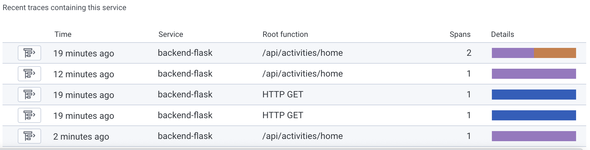
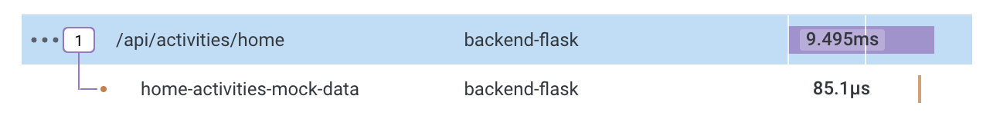
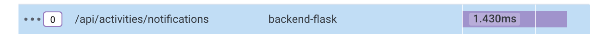
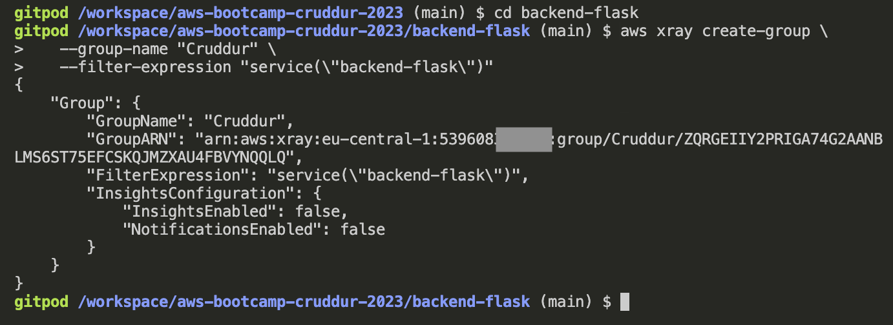
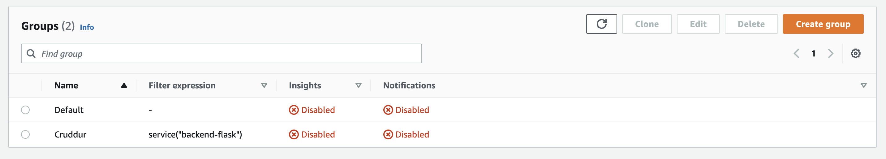
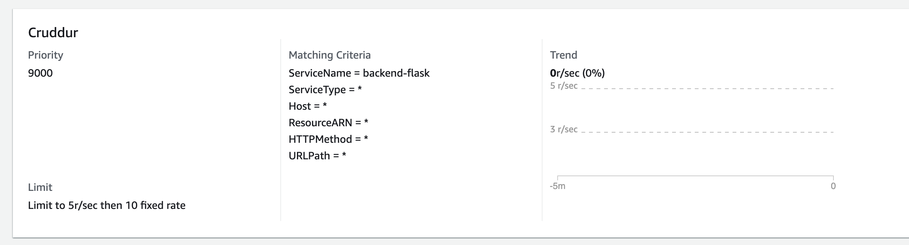
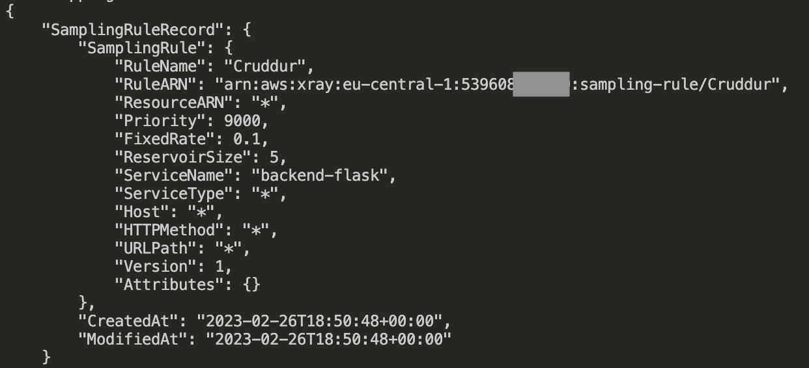
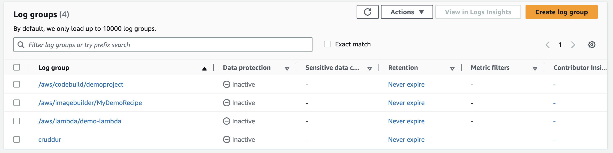
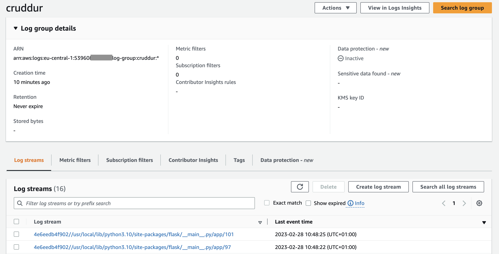

# Week 2 — Distributed Tracing

## Week 2 Tasks

These are the tasks I completed during this week.

```
✅ Implemented HoneyComb
✅ Implemented X-Ray
✅ Implemented CloudWatch Logs to my App
✅ Added Subsegments, Annotations and Metadata to X-Ray Traces
```

### ✅ Implemented HoneyComb

Here is the [commit](https://github.com/OpeOginni/aws-bootcamp-cruddur-2023/commit/e9e01d653578a899e6959ecb969cd97fba198556) that shows the implementation of HoneyComb to my app.

***Proof Of the Task***

- Recent Traces displayed on the HoneyComb site



- Trace for Route `/api/activities/home`


- Trace for Route `/api/activities/notification` 



### ✅ Implemented X-Ray

***Proof Of the Task***

- Created X-Ray Group Using CLI




- Created Sampling Rule





### ✅ Implemented CloudWatch Logs to my App

***Proof Of the Task***

- Log Group


- Active Logs


## Homework Challenges

### ✅ Implemented Subsegments, Annotations and Metadata from AWS X-Ray

For this task, I made use of the AWS Docs from there, I found some issues with Andrew's implementation of subsegments. Mainly I had to get rid of the `segment` declaration and also making use of the `xray_recorder.end_subsegment()` method.

I implemented subsegment in the notifications page, the [`notifications_activites.py`](https://github.com/OpeOginni/aws-bootcamp-cruddur-2023/blob/main/backend-flask/services/notifications_activities.py) file and in the [`user_activities.py`](https://github.com/OpeOginni/aws-bootcamp-cruddur-2023/blob/main/backend-flask/services/user_activities.py) file.

Here is the [Docs](https://docs.aws.amazon.com/xray/latest/devguide/xray-sdk-python-subsegments.html) I found during my research. 

Here is the [commit](https://github.com/OpeOginni/aws-bootcamp-cruddur-2023/commit/781e1b869ab1e903f7e661beda4c6b216467e179) of the implementation.

***Proof Of the Task***

- Trace Overview


- Complete Trace Data


- Part of Trace Data Showing **Subsegment, Annotations and Metadata**


