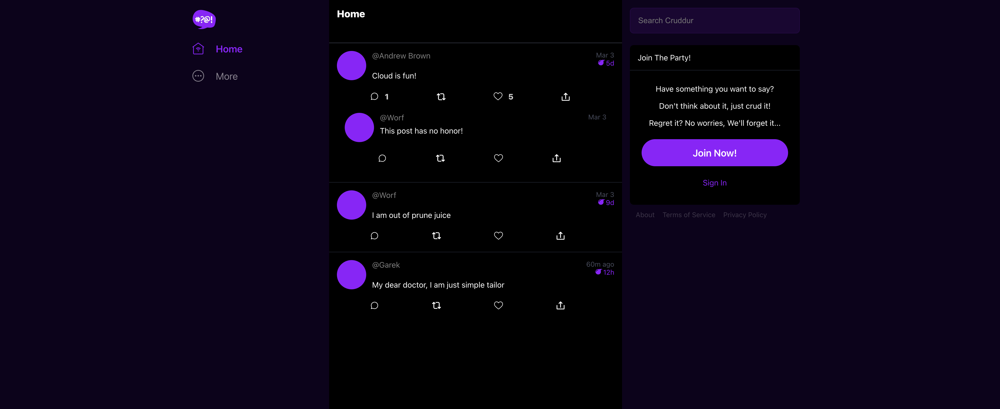
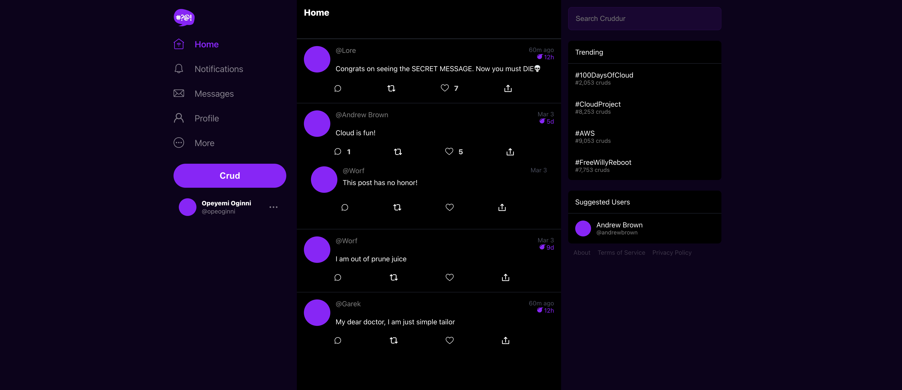
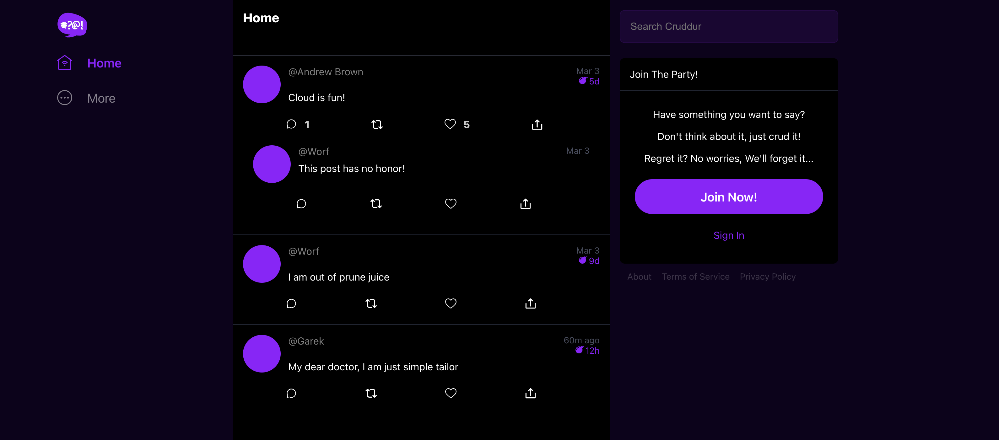
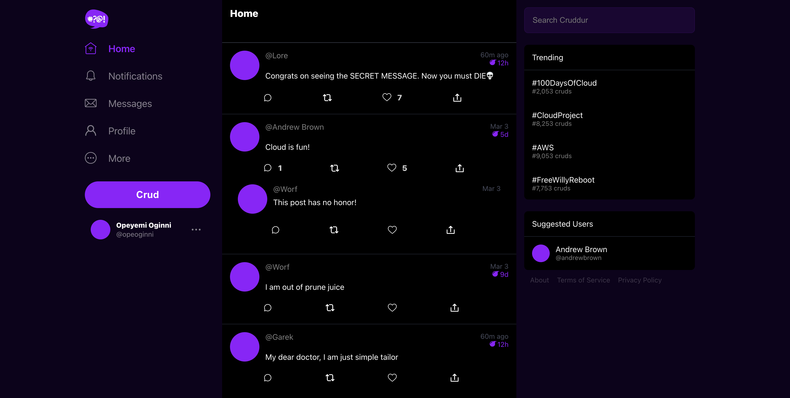
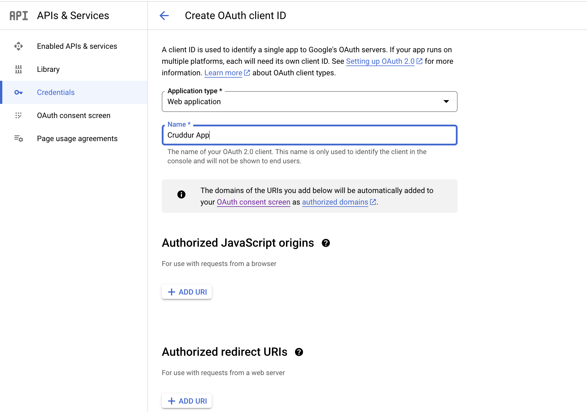

# Week 3 — Decentralized Authentication

## Week 3 Tasks

These are the tasks I completed during this week.

```
✅ Created Cognito User Pool
✅ Implemented Amazon Cognito for SignUp, SignIn, Confirm Password and Forgot Password features
✅ Implemented Check for the JWT Token on the Backend
✅ Tried to enable Auto-SignIn after User Confirms Email
✅ Made a slight change to the Promt Message after the Password has been Reset
✅ Implemented a middleware to verify the JWT
✅ Tried to Implement Sign In with Google Feature
```

### ✅ Created Cognito User Pool

***Proof Of the Task***


### ✅ Implemented Amazon Cognito for SignIn, SignUp, Confirm Password and Forgot Password features

- **SignIn**
Here is the [commit](https://github.com/OpeOginni/aws-bootcamp-cruddur-2023/commit/77166a2eac8388254193dc8343896938db6206bb) for my SignIn implementation using Amazon Cognito.

- **SignUp, Confirm Password and Forgot Password**
Here is the [commit](https://github.com/OpeOginni/aws-bootcamp-cruddur-2023/commit/a4232b55ca62130a1a3ed91eee65260ee5e0ccc4) for my SignUp, Confirm Password and Forgot Password implementation using Amazon Cognito.

***Proof Of the Task***


### ✅ Implemented Check for the JWT Token on the Backend

For this task, I followed through the video and I had issues as I am not 100% fluent with writing Python, but I was able to understand all implementation of the code. I found this concept of still mixing Cognito with the backend ver interesting and would be testing it out with NodeJS.

Here is the [commit](https://github.com/OpeOginni/aws-bootcamp-cruddur-2023/commit/2c752226b676e952de319eaf94103d7f2299fea3) where I made this implementation.

***Proof Of the Task***

**Home Page When Not Signed In ❌**



**Home Page When Signed In ✅**




## Homework Challenges

### ✅ Tried to enable Auto-SignIn after User Confirms Email

For this task, I made reaserch and found out of the `HUB` class from amplify that listens to events, and it can also listen to authentication events.

I made some rough implementation that is found in this [commit](https://github.com/OpeOginni/aws-bootcamp-cruddur-2023/commit/ac1f75e1b4aa04f4e34f729ae2772564a925a7ca).

After a long period of searching, debugging, I found out that this implementation wont work unless the confirmation method is located in the same file as the signUp method, this is so that the `confirmSignUp` function can have access to the password the user input and can call the `signIn` method on the inside of it.

I still plan on making this feature work, even if it involves refactoring the SignUp and ConfirmSignUp flow.

***Extra Debugging and Tests***

I came back to this issue and tried to make it work, I used ChatGPT to debug the code, and find out why the `confirmUser` function was not emiting the `autoSignIn` event. I still couldnt get it to work, so seems that the issue is from AWS. I will still be on the lookout for other solutions as this autoSignIn feature looks very smooth and easy for users.

My extra Testing can be found in this [commit](https://github.com/OpeOginni/aws-bootcamp-cruddur-2023/commit/3d21410f07464370171cc9b9ef72f4ffbbc8419e#diff-5cc5825850403ee1325a55220cdf3d9b19fe2efb228ad6458516c3eb45838349)

### ✅ Made a slight change to the Promt Message after the Password has been Reset

The commit can be found [here](https://github.com/OpeOginni/aws-bootcamp-cruddur-2023/commit/ac1f75e1b4aa04f4e34f729ae2772564a925a7ca#diff-1fd5e87231653eb3d24b789918f2743c9702c7fea73d01afb8ea19c8c4062543R123)

### ✅ Implemented a middleware to verify the JWT

The commit can be found [here](https://github.com/OpeOginni/aws-bootcamp-cruddur-2023/commit/3d21410f07464370171cc9b9ef72f4ffbbc8419e)

**This method is tested and works well, Signed In users have access to a secret Crud while signed out users don't. **

***Proof of Task***

**Home Page When Not Signed, In Using Middleware❌**



**Home Page When Signed In, Using Middleware✅**



### ✅ Tried to Implement Sign In with Google Feature
The commit can be found [here](https://github.com/OpeOginni/aws-bootcamp-cruddur-2023/commit/3d21410f07464370171cc9b9ef72f4ffbbc8419e#diff-55813ac909de93c5799998a0db382341f7546cfeab5545fa012925aea4dc467f)

I created a GoogleSignIn component and was planning on importing it into the SignIn page as a button.

***Issues Met***

When reading the Docs, I found out that most Social Authentication features required a Domain for the app, which is not available at the moment.


