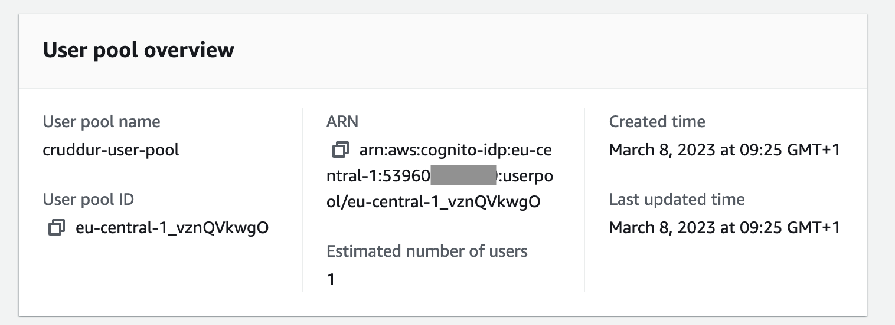
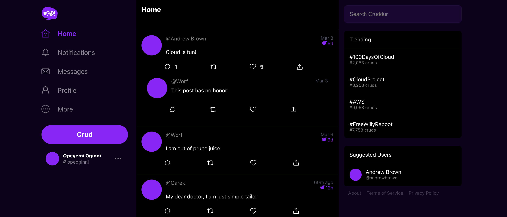

# Week 3 — Decentralized Authentication

## Week 3 Tasks

These are the tasks I completed during this week.

```
✅ Created Cognito User Pool
✅ Implemented Amazon Cognito for SignUp, SignIn, Confirm Password and Forgot Password features
✅ Tried to enable Auto-SignIn after User Confirms Email
✅ Made a slight change to the Promt Message after the Password has been Reset
```

### ✅ Created Cognito User Pool

***Proof Of the Task***



### ✅ Implemented Amazon Cognito for SignIn, SignUp, Confirm Password and Forgot Password features

- **SignIn**
Here is the [commit](https://github.com/OpeOginni/aws-bootcamp-cruddur-2023/commit/77166a2eac8388254193dc8343896938db6206bb) for my SignIn implementation using Amazon Cognito.

- **SignUp, Confirm Password and Forgot Password**
Here is the [commit](https://github.com/OpeOginni/aws-bootcamp-cruddur-2023/commit/a4232b55ca62130a1a3ed91eee65260ee5e0ccc4) for my SignUp, Confirm Password and Forgot Password implementation using Amazon Cognito.

***Proof Of the Task***



## Homework Challenges

### ✅ Tried to enable Auto-SignIn after User Confirms Email

For this task, I made reaserch and found out of the `HUB` class from amplify that listens to events, and it can also listen to authentication events.

I made some rough implementation that is found in this [commit](https://github.com/OpeOginni/aws-bootcamp-cruddur-2023/commit/ac1f75e1b4aa04f4e34f729ae2772564a925a7ca).

After a long period of searching, debugging, I found out that this implementation wont work unless the confirmation method is located in the same file as the signUp method. This is so that the `confirmSignUp` method can have access to the password the user input and can call the `signIn` method on the inside.

I still plan on making this feature work, even if it involves refactoring the SignUp and ConfirmSignUp flow.

### ✅ Made a slight change to the Promt Message after the Password has been Reset

The commit can be found [here](https://github.com/OpeOginni/aws-bootcamp-cruddur-2023/commit/ac1f75e1b4aa04f4e34f729ae2772564a925a7ca#diff-1fd5e87231653eb3d24b789918f2743c9702c7fea73d01afb8ea19c8c4062543R123)
