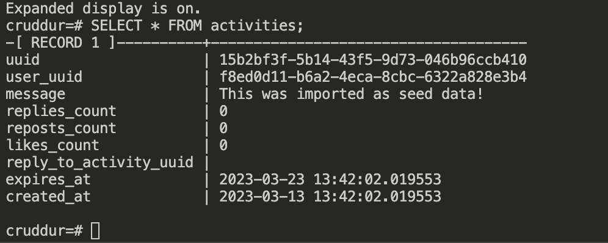

# Week 4 — Postgres and RDS

## Week 4 Tasks

These are the tasks I completed during this week.

```
✅ Created an RDS Postgres Instance
✅ Made bash scripts for common database actions
✅ Installed Postgres Driver in Backend Application
✅ Connected Gitpod to RDS Instance
✅ Created Congito Trigger to insert user into database
```

### ✅ Created an RDS Postgres Instance

***Proof Of the Task***


### ✅ Made bash scripts for common database actions

- **[db-connect](https://github.com/OpeOginni/aws-bootcamp-cruddur-2023/blob/main/backend-flask/bin/db-connect)**
- **[db-create](https://github.com/OpeOginni/aws-bootcamp-cruddur-2023/blob/main/backend-flask/bin/db-create)**
- **[db-drop](https://github.com/OpeOginni/aws-bootcamp-cruddur-2023/blob/main/backend-flask/bin/db-drop)**
- **[db-schema-load](https://github.com/OpeOginni/aws-bootcamp-cruddur-2023/blob/main/backend-flask/bin/db-schema-load)**
- **[db-sessions](https://github.com/OpeOginni/aws-bootcamp-cruddur-2023/blob/main/backend-flask/bin/db-sessions)**
- **[db-setup](https://github.com/OpeOginni/aws-bootcamp-cruddur-2023/blob/main/backend-flask/bin/db-setup)**
- **[rds-update-sg-rule](https://github.com/OpeOginni/aws-bootcamp-cruddur-2023/blob/main/backend-flask/bin/rds-update-sg-rule)**

***Proof Of the Task***




***Frontend Working with Imported Seed Data into PostgrSQL Container***

I was able to use and run the local PostgreSQL Database.


### ✅ Installed Postgres Driver in Backend Application

Here is the [commit](https://github.com/OpeOginni/aws-bootcamp-cruddur-2023/commit/9f31cd047cb8f961f4101edaaaf8d229dc0915f8) for this task.

### ✅ Connected Gitpod to RDS Instance

***Proof Of the Task***


### ✅ Created Congito Trigger to insert user into database

[Commit](https://github.com/OpeOginni/aws-bootcamp-cruddur-2023/commit/744fa3c5f480c15bfd76f7ee1c39791136f83670) showing the [`lambda functon`](https://github.com/OpeOginni/aws-bootcamp-cruddur-2023/commit/744fa3c5f480c15bfd76f7ee1c39791136f83670#diff-b338a2fe837c23358ed4fb5a07bf50dc053d855a802dec96e333c3156b05cafc) and the changes to the [`database schema`](https://github.com/OpeOginni/aws-bootcamp-cruddur-2023/commit/744fa3c5f480c15bfd76f7ee1c39791136f83670#diff-bbc12a1f400fea71904f24b48cd2032ec91f812c051c3957b664e36b4fc04887)

***Proof Of the Task***


**User Table after Signing Up in the FrontEnd**


## Personal Learning

- **Learnt how to make use of CloudWatch to debug Lambda functions**


- **Learnt how to create IAM Policies and attach them to roles for specific AWS resources**
- **Learnt how to allow a resource to have access to another resource by adding both to the same VPC**


