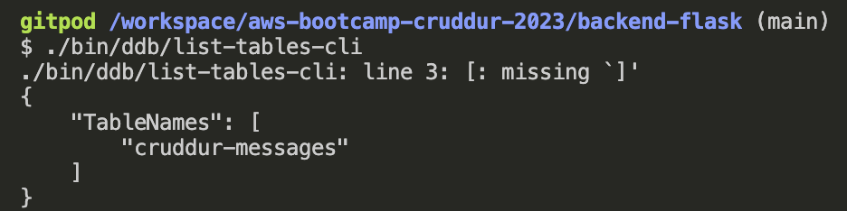
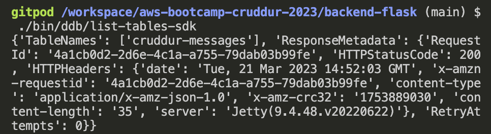
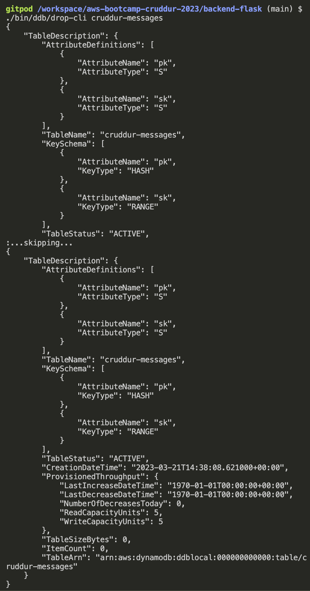
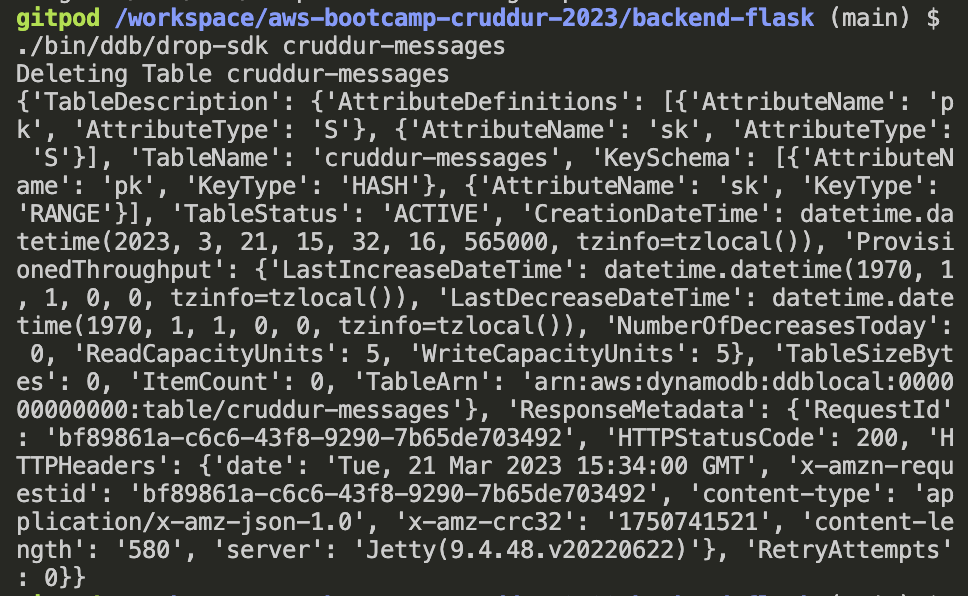

# Week 5 — DynamoDB and Serverless Caching

## Week 5 Tasks

These are the tasks I completed during this week.

```
✅ Created Scripts for DynamoDB
✅ Created command using Boto3 to list the DynamoDB tables
✅ Created command using Boto3 to drop the DynamoDB table
```

### ✅ Created Scripts for DynamoDB


## Homework Challenges

### ✅ Created command using Boto3 to list the DynamoDB tables

Commit for this task can be found [here](https://github.com/OpeOginni/aws-bootcamp-cruddur-2023/commit/8e052fd51857bed5ff1fc6054a407385c6865205)

For this task I went to the [Boto3 documentation](https://boto3.amazonaws.com/v1/documentation/api/latest/reference/services/dynamodb/client/list_tables.html) to find out how to list tables in DynamoDB, and them integrated it into the script [`list-tables-sdk`](https://github.com/OpeOginni/aws-bootcamp-cruddur-2023/blob/main/backend-flask/bin/ddb/list-tables-sdk).

***Proof Of the Task***

**Listing Tables using CLI**



**Listing Tables using Boto3 (SDK)**



### ✅ Created command using Boto3 to Drop a specific DynamoDB table

Commit for this task can be found [here](https://github.com/OpeOginni/aws-bootcamp-cruddur-2023/commit/3b4c198507ad44cb62215ded01ac3d9c7c374784)

For this task I went to the [Boto3 documentation](https://boto3.amazonaws.com/v1/documentation/api/latest/reference/services/dynamodb/client/delete_table.html ) to find out how to list tables in DynamoDB, and them integrated it into the script [`drop-sdk`](https://github.com/OpeOginni/aws-bootcamp-cruddur-2023/blob/main/backend-flask/bin/ddb/drop-sdk).

I made this script to be as alike as the script for the CLI. So using ChatGPT for assistance, I made it in a way that you can pass an arg in the command for the specific table you want to drop, and it returns an error mesage if the table name is not passed.

***Proof Of the Task***

**Dropping a Specific Table using CLI**



**Dropping a Specific Table using Boto3 (SDK)**


