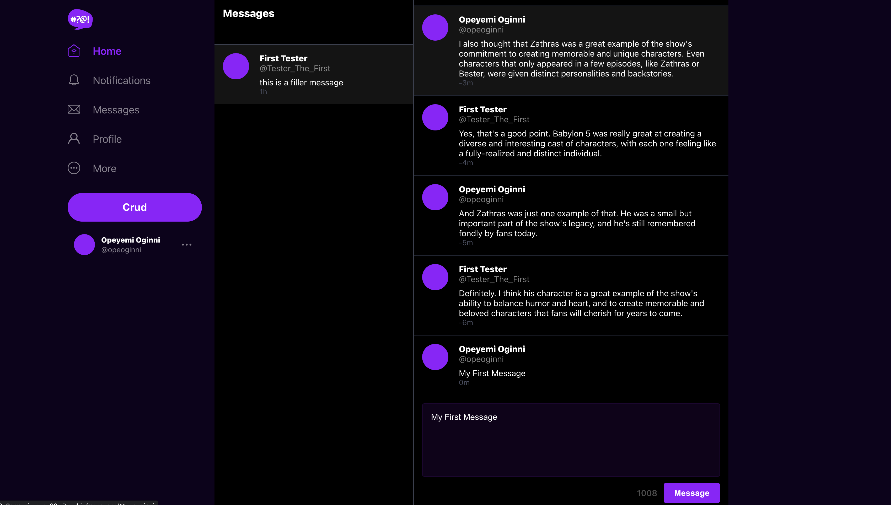
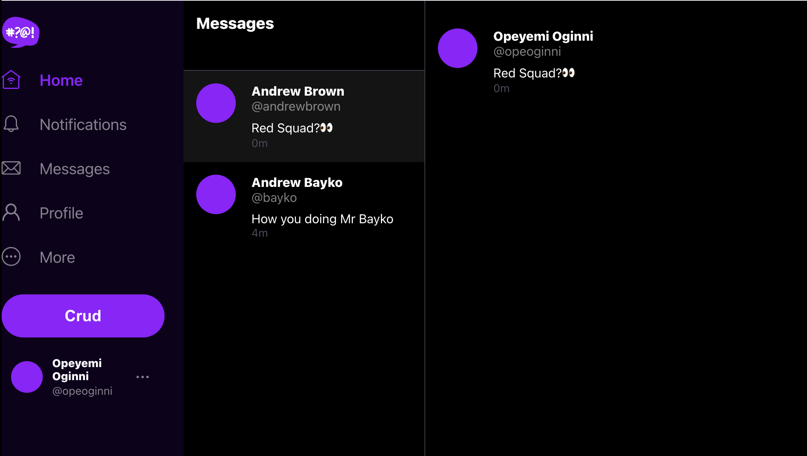

# Week 5 — DynamoDB and Serverless Caching

## Week 5 Tasks

These are the tasks I completed during this week.

```
✅ Created Multiple Utily Scripts for DynamoDB
✅ Implemented Pattern A (Listing Messages in Message Group into Application)
✅ Implemented Pattern B (Listing Messages Group into Application)
✅ Implemented Pattern C (Creating a Message for an exisiting Message Group into Application)
✅ Implemented Pattern D (Creating a Message for a new Message Group into Application)
✅ Implemented Pattern E (Updating a Message Group using DynamoDB Streams)
✅ Created command using Boto3 to list the DynamoDB tables
✅ Created command using Boto3 to drop the DynamoDB table
```

### ✅ Created Scripts for DynamoDB

- [Implemented Schema Load Script](https://github.com/OpeOginni/aws-bootcamp-cruddur-2023/blob/main/backend-flask/bin/ddb/schema-load)
- [Implemented Seed Script](https://github.com/OpeOginni/aws-bootcamp-cruddur-2023/blob/main/backend-flask/bin/ddb/seed)
- [Implemented Scan Script](https://github.com/OpeOginni/aws-bootcamp-cruddur-2023/blob/main/backend-flask/bin/ddb/scan)
- [Implemented Pattern Scripts for Reading and Listing Conversations](https://github.com/OpeOginni/aws-bootcamp-cruddur-2023/tree/main/backend-flask/bin/ddb/patterns)
- [Implemented Update Cognito ID Script for Postgres Database](https://github.com/OpeOginni/aws-bootcamp-cruddur-2023/blob/main/backend-flask/bin/db/update_cognito_user_ids)

### ✅ Implementation of Pattern A, B, C, D and E

The commits for the implementation of all the patterns to make our messaging system with DynamoDB possible are listed bellow;

- [**Commit 1**](https://github.com/OpeOginni/aws-bootcamp-cruddur-2023/commit/90e7945902a424b4b5c07083452f15a83fc050d4): For this commit I made some changes to my Verify JWT middleware, I refactored the `message_group` backend service to be able to obtain users uuid from their `cognito_user_id` and then list all messages for that particular user.

- [**Commit 2**](https://github.com/OpeOginni/aws-bootcamp-cruddur-2023/commit/416e0dfe120a3bf352c01eaa3d9a573f36e3f565): For this commit I made changes to the authentication process in some of the frontend pages.

- [**Commit 3**](https://github.com/OpeOginni/aws-bootcamp-cruddur-2023/commit/7b7a5a1354d9a7ea573dc944ee31aa8b5ac513ea): For this commit I implemented creation and updating of messages function.

- [**Commit 4**](https://github.com/OpeOginni/aws-bootcamp-cruddur-2023/commit/8f0cfd8ab9f70772d6d40f1327bf7d21181bd8ac): For this commit I completed all of the week by finally implementing DynamoDB Streams.

***Proof Of the Task***

**Message Functionlity on LocalHost with Test Conversations**



**Message Functionlity on DynamoDB using Lambda Functions and DynamoDB Streams to Update Message Groups**



## Homework Challenges

### ✅ Created command using Boto3 to list the DynamoDB tables

Commit for this task can be found [here](https://github.com/OpeOginni/aws-bootcamp-cruddur-2023/commit/8e052fd51857bed5ff1fc6054a407385c6865205)

For this task I went to the [Boto3 documentation](https://boto3.amazonaws.com/v1/documentation/api/latest/reference/services/dynamodb/client/list_tables.html) to find out how to list tables in DynamoDB, and them integrated it into the script [`list-tables-sdk`](https://github.com/OpeOginni/aws-bootcamp-cruddur-2023/blob/main/backend-flask/bin/ddb/list-tables-sdk).

***Proof Of the Task***

**Listing Tables using CLI**


**Listing Tables using Boto3 (SDK)**


### ✅ Created command using Boto3 to Drop a specific DynamoDB table

Commit for this task can be found [here](https://github.com/OpeOginni/aws-bootcamp-cruddur-2023/commit/3b4c198507ad44cb62215ded01ac3d9c7c374784)

For this task I went to the [Boto3 documentation](https://boto3.amazonaws.com/v1/documentation/api/latest/reference/services/dynamodb/client/delete_table.html ) to find out how to list tables in DynamoDB, and them integrated it into the script [`drop-sdk`](https://github.com/OpeOginni/aws-bootcamp-cruddur-2023/blob/main/backend-flask/bin/ddb/drop-sdk).

I made this script to be as alike as the script for the CLI. So using ChatGPT for assistance, I made it in a way that you can pass an arg in the command for the specific table you want to drop, and it returns an error mesage if the table name is not passed.

***Proof Of the Task***

**Dropping a Specific Table using CLI**


**Dropping a Specific Table using Boto3 (SDK)**


**Issues For this Week**

Apart from the occasional bug fixing and personal mistakes, a major issues I had was stoping a video half way and coming back the next day and being unable to continue as I forgot important steps needed to properly get myself ready to continue the lesson. To solve this I started keeping notes on important commands that I run and the function of that command. This really helped when coming back to a video and makes it easy to continue following along as if I never paused.
