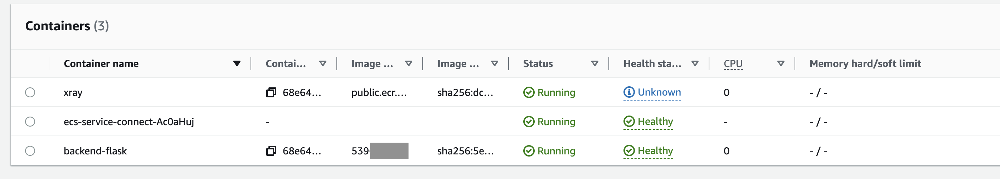

# Week 6 — Deploying Containers

## Week 6 - 7 Tasks

These are the tasks I completed during the two weeks.

```
✅ Provisioned ECS Cluster
✅ Created ECR repo and push image for backend-flask and deployed the Backend Flask app as a service to Fragate
✅ Create ECR repo and push image for fronted-react-js and deployed the Frontend React app as a service to Fragate
✅ Provisioned and configured an Application Load Balancer along with target groups
✅ Managed my domain using Route53 via hosted zone, Create an SSL cerificate via ACM
✅ Setup a record set for naked domain to point to frontend-react-js
✅ Secured Flask by not running in debug mode
✅ Implement Refresh Token for Amazon Cognito
✅ Refactor bin directory to be top level	
✅ Configure task defintions to contain x-ray and turn on Container Insights	
✅ Change Docker Compose to explicitly use a user-defined network		
✅ Create Dockerfile specfically for production use case	
✅ Used ruby to generate out env dot files for docker using erb templates
✅ Fixed Messages in Production	
```
### ✅ Provisioned ECS Cluster

***Proof Of the Task***

**Cruddur ECS Cluster **


### ✅ Created ECR repo and push image for backend-flask and deployed the Backend Flask app as a service to Fragate

The commit for this implementation is found [here](https://github.com/OpeOginni/aws-bootcamp-cruddur-2023/commit/b39670ab2cf23a151243aacaccc5a2726ba370a4)

***Proof Of the Task***

**Backend Flask Sevice Details **


### ✅ Created ECR repo and push image for backend-flask and deployed the Backend Flask app as a service to Fragate

The implementation of this task is shared across the following Commits.

- [**Commit 1**](https://github.com/OpeOginni/aws-bootcamp-cruddur-2023/commit/5febf62d106a569437fe5957b2f97359287528fd): Created the Task Definition for the frontend react app. also created the Docker.prod file.
- [**Commit 2**](https://github.com/OpeOginni/aws-bootcamp-cruddur-2023/commit/46756f269490b42e8e425203d1e2f4f80631bfc8): Created a nginx.conf file.
- [**Commit 3**](https://github.com/OpeOginni/aws-bootcamp-cruddur-2023/commit/9378244d6b16027cb007a7f3f50c061624c77eaf): Created the service json file.

***Proof Of the Task***

**Frontend React Sevice Details **


### ✅ Provisioned and configured an Application Load Balancer along with target groups

***Proof Of the Task***

**Production Cruddur App working using my alb DSN name**


### ✅  Managed my domain using Route53 via hosted zone, Create an SSL cerificate via ACM

***Proof Of the Task***


### ✅ Setup a record set for naked domain to point to frontend-react-js

***Proof Of the Task***


### ✅ Implement Refresh Token for Amazon Cognito

The commit for this implementation is found [here](https://github.com/OpeOginni/aws-bootcamp-cruddur-2023/commit/5e69c4d3d658670f1a3d3bc888f664e232be33ed)

### ✅ Refactor bin directory to be top level	

The commit for this implementation is found [here](https://github.com/OpeOginni/aws-bootcamp-cruddur-2023/commit/fd5c88ef9f5400a44570dcb41352aa6d5f5c7be5)

***Proof Of the Task***

https://github.com/OpeOginni/aws-bootcamp-cruddur-2023/tree/main/bin

### ✅ Configure task defintions to contain x-ray and turn on Container Insights	

***Proof Of the Task***




### ✅ Change Docker Compose to explicitly use a user-defined network		

The commit for this implementation is found [here](https://github.com/OpeOginni/aws-bootcamp-cruddur-2023/commit/22079c49910bc4e953cc67c9bf54d95faf6a1bea#diff-e45e45baeda1c1e73482975a664062aa56f20c03dd9d64a827aba57775bed0d3)

### ✅ Used ruby to generate out env dot files for docker using erb templates		

The commit for this implementation is found [here](https://github.com/OpeOginni/aws-bootcamp-cruddur-2023/commit/22079c49910bc4e953cc67c9bf54d95faf6a1bea#diff-e45e45baeda1c1e73482975a664062aa56f20c03dd9d64a827aba57775bed0d3)

### ✅ Fixed Messages in Production	

***Proof Of the Task***


