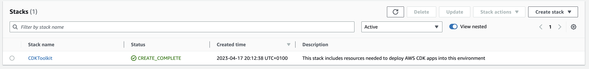
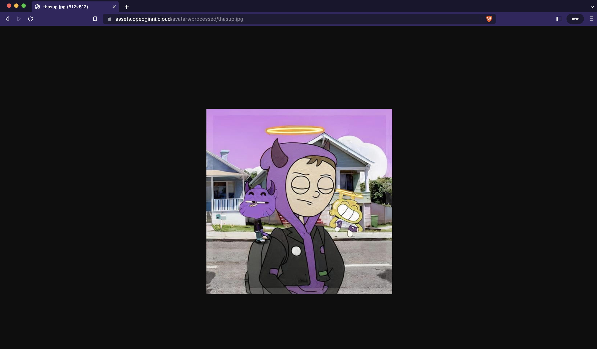
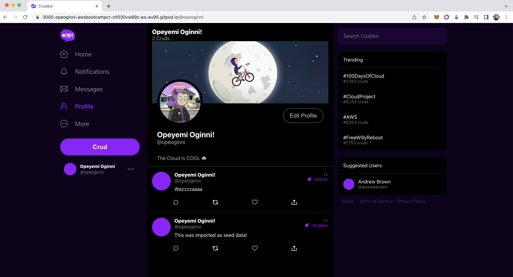
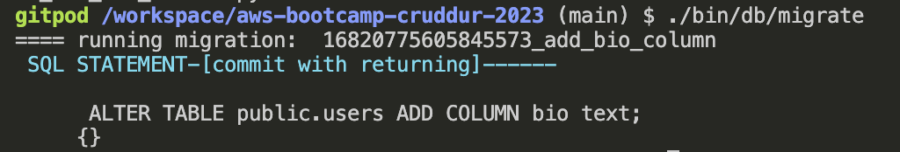
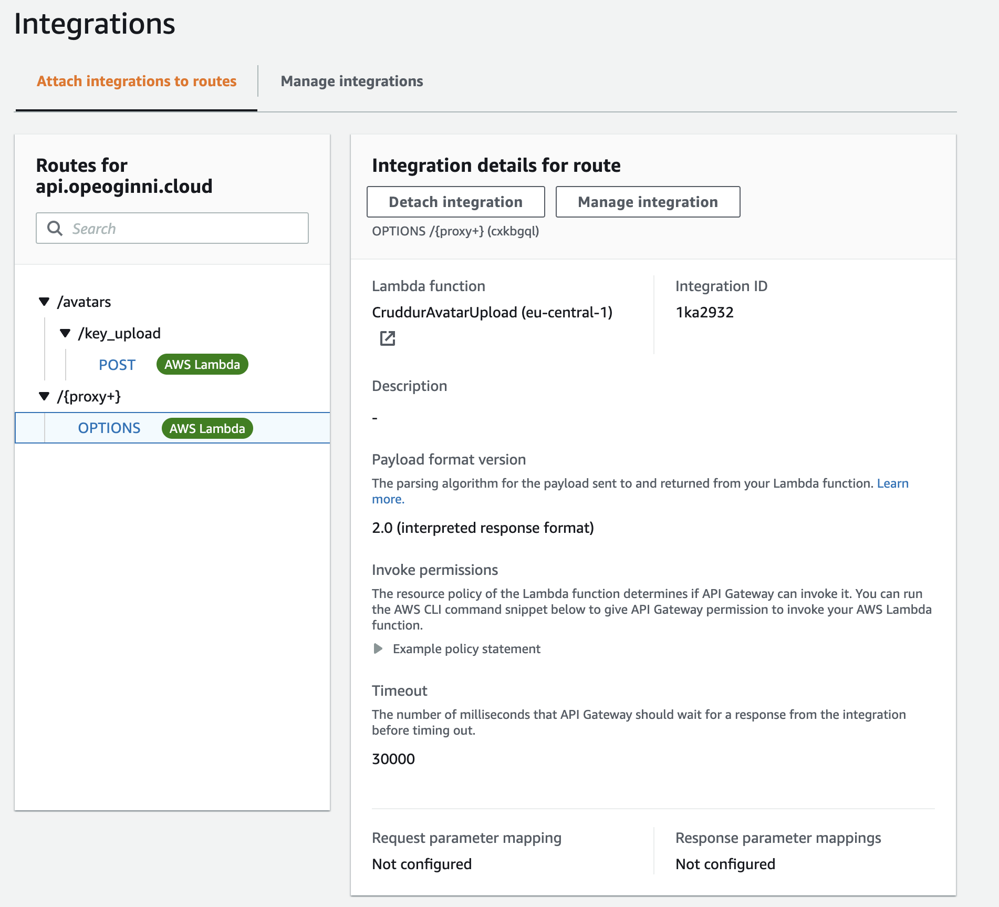
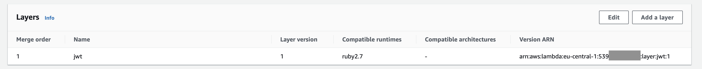
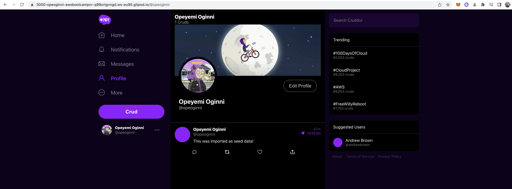

# Week 8 — Serverless Image Processing

## Week 8 Tasks

These are the tasks I completed during week 8.

```
✅ Implemented CDK Stack	
✅ Served Avatars via CloudFront	
✅ Implemented Users Profile Page	
✅ Implemented Users Profile Form	
✅ Implemented Backend Migrations	
✅ Presigned URL generation via Ruby Lambda	
✅ HTTP API Gateway with Lambda Authorizer	
✅ Created JWT Lambda Layer	
✅ Render Avatars in App via CloudFront		
```

### ✅ Implemented CDK Stack

Watched the week 8 - Serverless Image Processing live session, and got to learn about the AWS SDK. I statred making little reaserch on what processes I can implement using the SDK. I also came accross this GitHub Account by AWS called [**AWS samples**](https://github.com/aws-samples) where is a Repo with lot of examples on how to use the CDK, I plan to use this repo for my personal projects and to learn more. I really enjoy using the Typescript languge. Here is a link to all CDK samples provided in TypeScript [**AWS-CDK-Examples**](https://github.com/aws-samples/aws-cdk-examples/tree/master/typescript)

***Proof Of Task***



### ✅ Served Avatars via CloudFront	

Task [commit](https://github.com/OpeOginni/aws-bootcamp-cruddur-2023/commit/d136fd95f5a7b495a88cf43f4bb3a74b8db74a7e)

***Proof Of Task***



### ✅ Implemented Users Profile Page	

Task [commit](https://github.com/OpeOginni/aws-bootcamp-cruddur-2023/commit/ad990506d9783f501101a9913a28538043d10498)

***Proof Of Task***



### ✅ Implemented Users Profile Form	

Task [commit](https://github.com/OpeOginni/aws-bootcamp-cruddur-2023/commit/0d71415be4fb8dc24cf7eff81893cc48ef1cb571)

### ✅ Implemented Backend Migrations	

Task [commit](https://github.com/OpeOginni/aws-bootcamp-cruddur-2023/commit/0d71415be4fb8dc24cf7eff81893cc48ef1cb571)

***Proof Of Task***



### ✅ Presigned URL generation via Ruby Lambda	

***Task commits***

- [Created Ruby Lambda Function](https://github.com/OpeOginni/aws-bootcamp-cruddur-2023/commit/3dcc198ae41b7aee1f5ed993b3603770bb859a27)
- [Updated Image Upload Ruby Lambda Function and Created Lambda Authorizer Function](https://github.com/OpeOginni/aws-bootcamp-cruddur-2023/commit/d8ddf40af48954c0f44913f001e4130b5680d0a6)
- Final [`Ruby Lambda Function`](https://github.com/OpeOginni/aws-bootcamp-cruddur-2023/tree/main/aws/lambdas/cruddur-upload-avatar) and [`Lambda Authorizer Function`](https://github.com/OpeOginni/aws-bootcamp-cruddur-2023/tree/main/aws/lambdas/lambda-authorizer)


### ✅ HTTP API Gateway with Lambda Authorizer

***Proof Of Task***



### ✅ Created JWT Lambda Layer

***Proof Of Task***



### ✅ Render Avatars in App via CloudFront	

Task [commit](https://github.com/OpeOginni/aws-bootcamp-cruddur-2023/commit/15c9a8f5434091126061496d35e17e21e55259a1)

***Proof Of Task***


