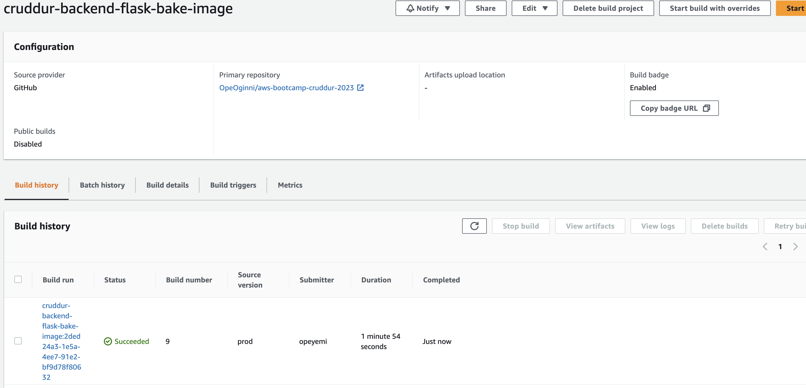
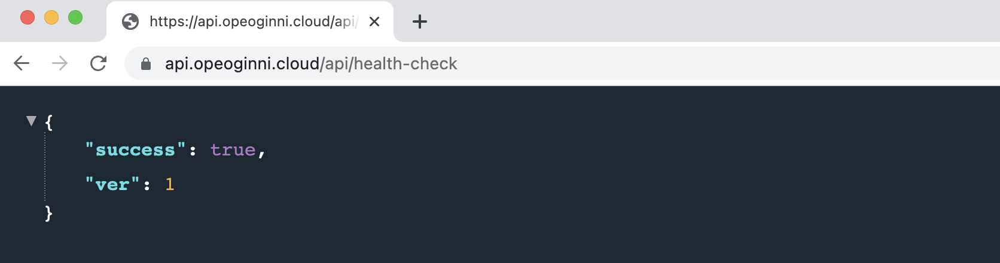
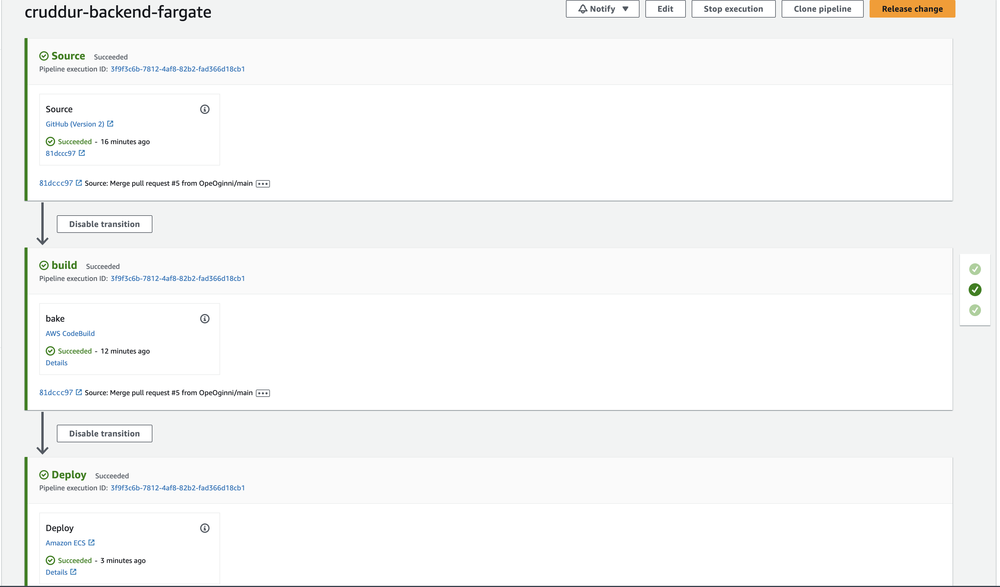

# Week 9 — CI/CD with CodePipeline, CodeBuild and CodeDeploy

## Week 9 Tasks

These are the tasks I completed during week 9.

```
✅ Configured CodeBuild
✅ Created Prod Branch
✅ Configured CodePipeline
```

### ✅ Configured CodeBuild

Watched the First and Second Part of setting up Code Build and followed the instructions to set it up myself.

Personally ran through some issues, some because I missed a step in the tutorial, others I just had to do some debuging, the discord helped a lot as others have given asnwers to the issues I had already.

***Proof Of Task***



### ✅ Configured CodePipeline

***Proof Of Task***

## Commited a change on GitHub, merged to the Prod branch, and the change is made to production using CodePipeline



## My Cruddur CodePipeline



